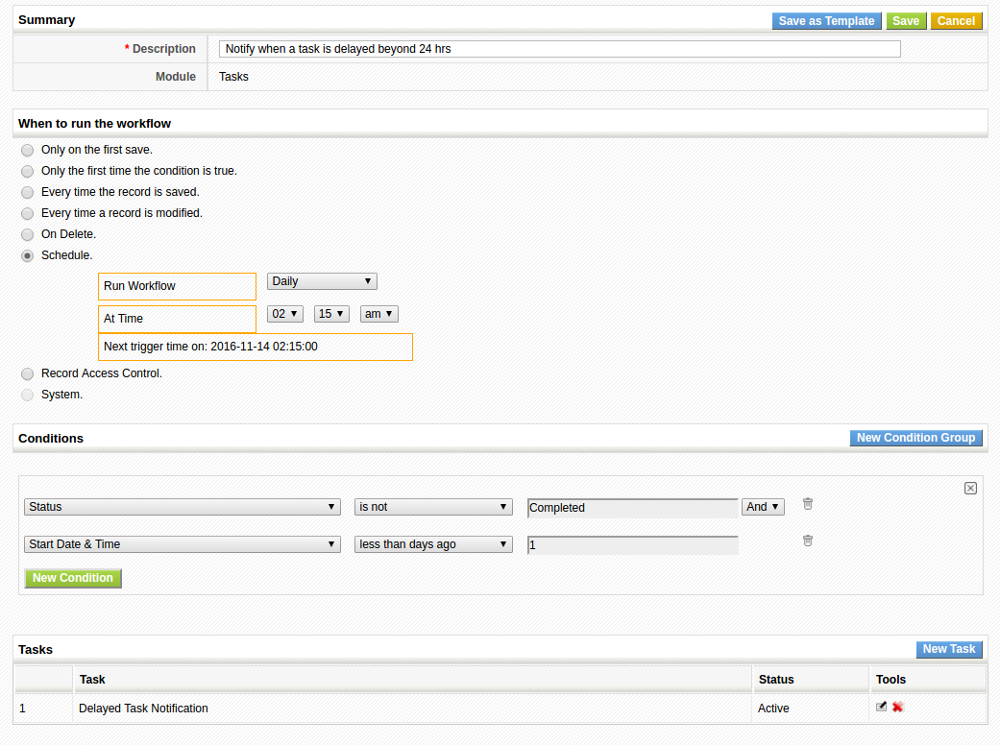
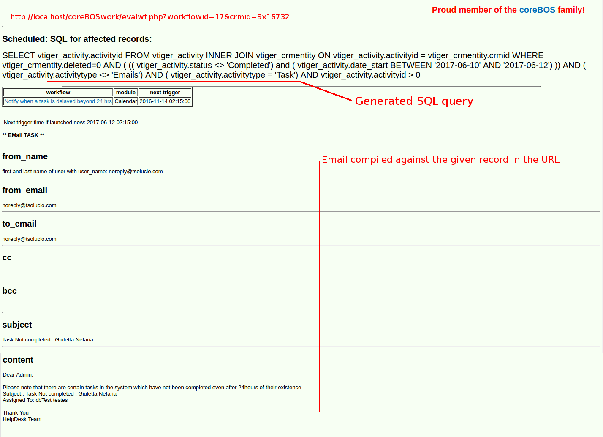

The possibility of launching tasks based on time is fundamental to any application like **coreBOS**, so we added this functionality. Read all about it in this post.

===

As of March 2015, we can launch workflows based on time. In other words, you can have the system do something automatically once a week, or twice a day, every hour or every other month,...

The different launch times are:
 - **Hourly:** Workflow is executed every hour
 - **Daily:** Workflow is executed every day at the specified time
 - **Weekly:** Workflow is executed on the selected days of every week
 - **On Specific Date:** Workflow is executed on the selected date
 - **Monthly by Date:** Workflow is executed on the selected days of every month
 - **Yearly:** Workflow is executed on the selected day of every year

This workflow trigger is fundamentally different than the other triggers. All the other triggers in the system are launched on an individual record, when something happens to that record, mostly a save action but also when it is deleted.

The scheduled workflows wake up at the established time and launch a query. Then they launch the associated workflow tasks for each record obtained from the query.

This implies various things.
 1. When we are defining the conditions we have to think in sets, in the set of records we are trying to access. We are not defining conditions on one record but on the whole set of records in the module.
 2. There are conditions that do not exist like "has changed". We are not saving anything, just retrieving information from the database, nothing has changed.
 3. Some tasks can be dangerous and must be used with caution and understanding. For example, if you create an update task you will overwrite the fields for all records that fulfill the conditions with no option to get the previous value (well, more or less, depending on your configuration), so be careful you are getting the right records.
 4. Also, you must consider the impact a simple scheduled workflow may have. Following the previous example, imagine that the update workflow creates another entity, modifies some other field and sends out an email. Now imagine that the scheduled workflow retrieves 1000 records. That is a lot of work for the server and a big impact in the application if you get it wrong.
 5. Scheduled workflows are limited to 10 in an attempt to minimize the overload on the server, but that can be configured setting the **Workflow_Maximum_Scheduled** global variable. I recommend that you plan your scheduled workflows carefully, distribute them through the day, don't put them all at the same hour.
 6. Since scheduled workflows are time-based and we can't use expressions in the conditions, there are some special operators for scheduled workflows like:
  * Less than hours/days before
  * Less than hours/days later
  * More than hours/days before
  * More than hours/days later

 !!! The **evalwf** tool

The [evalwf tool](http://corebos.org/documentation/doku.php?noprocess=0&id=en:devel:helperscripts#evalwfphp) supports scheduled workflows. This is a very powerful tool that we should integrate directly into the application. When launched against a scheduled workflow this tool will show us the query that is being created so you can evaluate if it is what you are looking for (if you know how to read SQL and have some knowledge of the database structure). Here I leave a few screenshots as an example

 ! The default Delayed Task Workflow

 ! The default Delayed Task Workflow, workflow task

 ! The result of executing evalwf against a task record

 !!! More Information

You can read more details on the **coreBOS Documentation Project** [scheduled workflow page](http://corebos.org/documentation/doku.php?noprocess=0&id=en:scheduled_workflows).

**Thanks for reading.**

