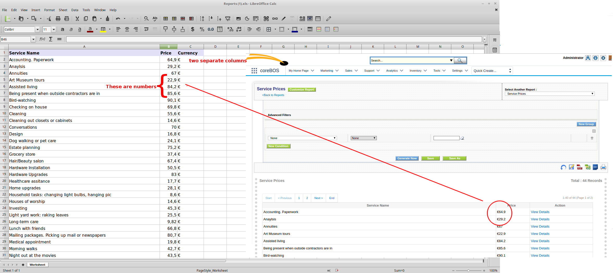
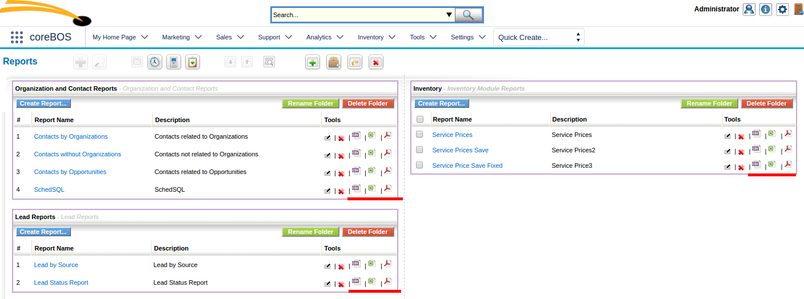

September is usually a slow month as we are getting back to the routine after the summer slow down and I get a some relax time. However coreBOS gets some really important features in September 2014 as we continue to create a stable, feature rich and powerful platform to manage your business.

===

### Development

 ! Spreadsheet currency export enhancements
We separated the currency symbol from the amount in currency fields and convert them to numbers so they can be easily operated on in the spreadsheet.

 ! Emails on Tickets, Projects and Potentials
 
We add natve support for emails on tickets, projects and potentials. This permits associating emails to any record in these module as long as they were sent to the related account or contact. The way this works is by saving the email if the related account or contact into a read only field on the record and then relating the email to the value in that field. This is rather forced but it is the way vtiger crm worked at that moment, and we are trying to keep backward compatibility at this point in time.

This is fundamental for our [coreBOS Mail Project](http://corebosmail.tsolucio.com) which is an integration between [Roundcube Mail](https://roundcube.net/) and **coreBOS**.

 ! Calendar4You

During August 2014 we have been speaking with the team at [ITS4You](http://its4you.sk/) and they donate the code of their Calendar4You project to coreBOS. **Thank you very much for this support** to the project.

We incorporate the new calendar into coreBOS as the default calendar and add native support for Timecontrol records.

 ! Alphabetical order everywhere
 
We start a long running project to sort all picklists and group options in the application making them more user friendly. This will run various months until we get them all, but the big initial group is done this month.

 ! Export buttons on report listing

At this point in time we still have inherited one of the bigger problems in the reporting system of vtiger crm which is the slowness and the sending of very big reports to the browser. Additionally, in order to export the report to a Spreadsheet or PDF you have to go in to the report and generate it on screen, which is sometimes impossible. **AT Consulting** developed an enhancement to add the export buttons directly on the report listing avoiding the unnecessary VERY slow step of sending the report for the browser when you just want to launch an export. Thanks!!

> As a side note, on the date of writing this blog post this problem has been completely solved by optimizing the reporting system significantly and paging the reports.

 ! Webservice enhancements
 
In our constant **webservice interface** enhancements we add a whole set for new functionality specially oriented towards the customer portal implementations. For example Portal user login so contacts can log in with their credentials and access the CRM via the webservice interface.

 ! Developer Enhancements

 - [Popup capture hook](http://corebos.org/documentation/doku.php?id=en:devel:corebos_hooks:popup_capture_hook&noprocess)
 - getfieldfromblockarray to access and manipulate the display blocks array which has a very complex structure

.

 ! Some others:

 - Install modules directly from github
 - Eliminate warnings and code cleanup (this one is a constant every month, even today)
 - Translation and special characters support
 - Security and speed

**Thanks for reading.**

