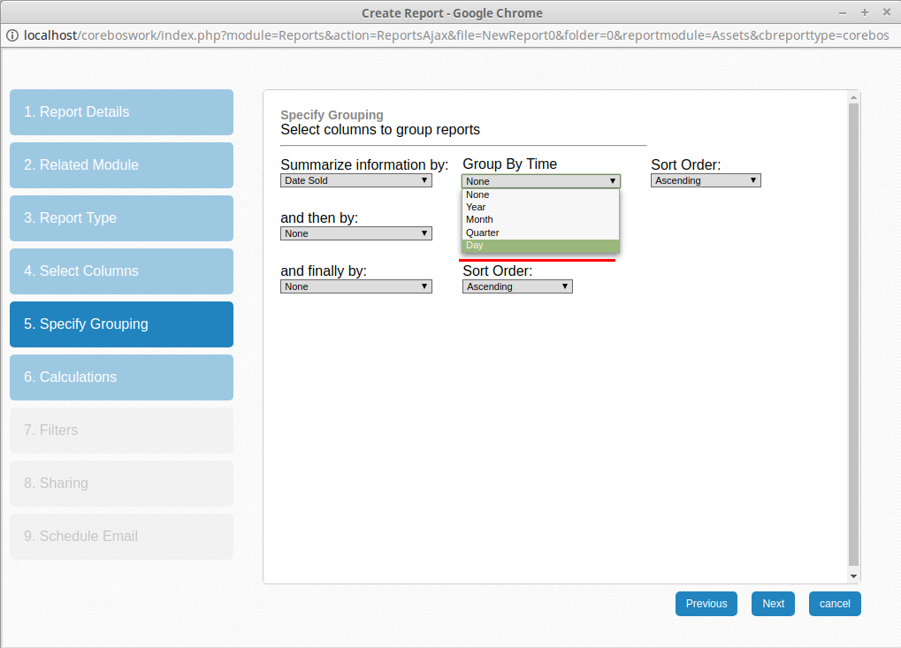

We start updating the application to support newer versions of PHP and MySQL while we keep enhancing the workflow and business map systems and creating a better developer and implementor experience.

===

 ! coreBOS Updater API: mass create fields

coreBOS Updater is an incredibly powerful tool that has changed the way we construct software solutions, but it isn't just about easily keeping your install up to date with the constant changes we introduce, it is also an infrastructure that helps developers adapt the application to different client needs.

In this line you can add your own update scripts to do typical tasks that you do for your clients and to help you with that, we add an API to easily mass create fields. Given an array like this

```
array(
	'{modulename}' => array(
		'{blockname}' => array(
			'{fieldname}' => array(
				'columntype'=>'decimal(10,3)',
				'typeofdata'=>'NN~O',
				'uitype'=>'1',
				'displaytype'=>'3',
				'label'=>'', // optional, if empty fieldname will be used
				'massedit' => 0 | 1  // optional, if empty 0 will be set
				'mods'=>array(module names), // used if uitype 10
				'vals'=>array(picklist values), // used if uitype 15 or 16
		),
	)),
```

It will create all the fields for us on each module and block.

See [changeset addLeadEmailOptOutAndConversionRelatedFields for an example](https://github.com/tsolucio/corebos/blob/master/build/changeSets/addLeadEmailOptOutAndConversionRelatedFields.php)

 ! Converted from Lead functionality

We add a checkbox and capture field to accounts, contacts, and potential that indicate if the record was created from a lead or not and points to the lead they were created from if that is the case. These fields are filled in automatically on lead conversion.

Note that the capture field can only be seen on list view and reports.

 ! Validations

Now that we have an extensible validation library we start adding some native validation methods. This month we add

 - a [validation of the EU VAT number](https://github.com/tsolucio/corebos/blob/master/include/validation/Validations.php#L71)
 - [not duplicate record on any field](https://github.com/tsolucio/corebos/blob/master/include/validation/Validations.php#L93), this is another one of those things that we get asked a lot and that now is extremely easy to do

We also add support for PHP validations on the calendar module.

 ! Workflows

 - Better picklist conditions permitting full expression editor
 - Support for [comments in email task](http://corebos.org/documentation/doku.php?noprocess=1&id=en:email_workflows#comments)
 - Format dates by the user assigned to record. Now date fields are sent formatted based on the settings of the user assigned to the record instead of the default admin user
 - Return the user name when using owner reference field in update task
 - Group email list meta-variable: groupEmailList
 - Emails launch Workflows on access count increment

<br/>

 ! Web Service

 - add comment now launches Workflows
 - support for more information on inventory lines if Master-Detail mapping exists

<br/>

 ! Helpdesk

 - Sort comments by date
 - Clean up commentadded field to control workflow conditions and launch tasks accordingly
 - We can now [override default emails with workflows](http://corebos.org/documentation/doku.php?id=en:helpdesk:notificationemails)
 - Support for special characters

<br/>

 ! Business Maps

 - [IOMap](http://corebos.org/documentation/doku.php?noprocess=1&id=en:adminmanual:businessmappings:iomap) which can be used to map output values to input values in external processes
 - [Field dependency map](http://corebos.org/documentation/doku.php?noprocess=1&id=en:adminmanual:businessmappings:field_dependency) which is in a very early stage
 - [Validation map](http://corebos.org/documentation/doku.php?noprocess=1&id=en:adminmanual:businessmappings:validations), at this point in time we simply create the validation business map, it is still not integrated into the application like it is now
 - [Import map](http://corebos.org/documentation/doku.php?noprocess=1&id=en:adminmanual:businessmappings:import) to support unattended scheduled imports
 - [Field mapping](http://corebos.org/documentation/doku.php?noprocess=1&id=en:adminmanual:businessmappings:mapping) support for related fields and templates

<br/>

 ! MySQL strict

We start adapting the SQL commands in the application to the new default settings of MySQL which force the programmers to construct better and faster SQL

 ! PHP 7

We start another long-running project to adapt coreBOS to PHP 7. In the next months, we will slowly be making changes to keep the application running as it does while being able to run on higher versions of PHP.

We take the first steps to upgrade Smarty, eliminate PHP and other syntax changes

 ! Developer Enhancements

 - [Simple template on data](https://github.com/tsolucio/corebos/blob/master/modules/com_vtiger_workflow/VTSimpleTemplateOnData.inc) a new developer class that permits us to use the same workflow email parser on any given text in the context of an array of data instead of an entity record ID
 - [Browser variables](https://github.com/tsolucio/corebos/blob/master/Smarty/templates/BrowserVariables.tpl#L12). JavaScript development is getting more and more important as the browser becomes the defacto standard user interface. In order to make browser development easier we send a set of application backend variables so they can be used directly.

<br/>

 ! Reports day Grouping

This reporting option does not permit you to make aggregations on rows, it simply sorts the records based on the date part selected. So all the values of the same day will be together no matter what month or year they are from. We are selecting how to order the records, not how to aggregte them.



 ! Some others:

 - Full decimal support on inventory modules
 - Document vendor relation
 - Theming, convert inline edit actions to CSS class based buttons
 - Module manager modules on one screen
 - Lead conversion permit mapping picklist to text
 - Global variable **EMail_OpenTrackingEnabled**
 - Tooltip everywhere
 - ModComments: special characters, send via post to support large texts, style buttons
 - Update phpmailer
 - Update adodb
 - Project task status field
 - Eliminate warnings, notice, MySQL strict and code cleanup (this one is a constant every month, even today).
 - Translation. Notice warnings, eliminate unused code, cleanup

**<span style="font-size:large">Thanks for reading.</span>**

