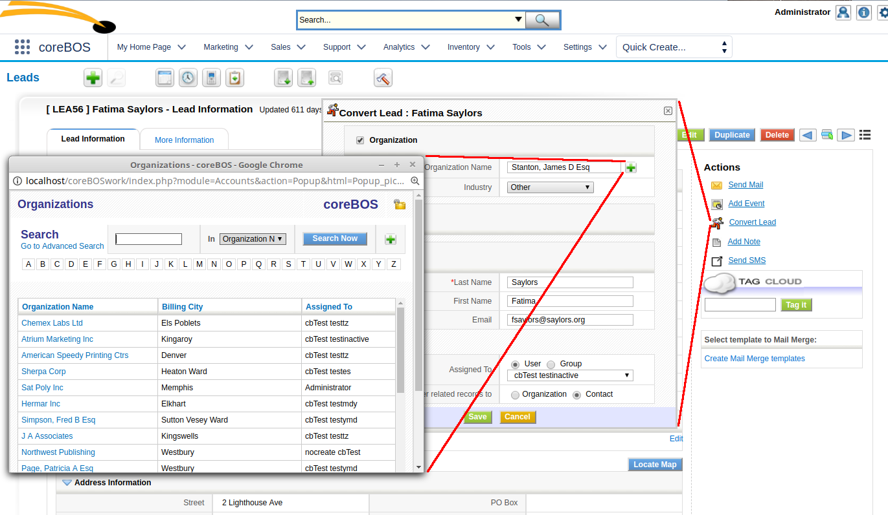

As we concentrate on making coreBOS safer, faster and bug-free, we revisit the calendar module and reporting extension while we keep adding configuration options and features. **Enjoy!**

===

 ! Calendar

 - activate all-day field in the database
 - all day events, refactor drag and resize events
 - Calendar_PopupReminder_DaysPast global variable for reminder popups
 - field dependency between date_start and date_end
 - validations: planned start in future, recurring check is month date and follow up is after the end date
 - add support for 12h format in getaddEventPopupTime
 - avoid warning in quickcreate changeset
 - cbCalendar install with no time limit for installs with a lot of calendar events
 - check and Restore Email Relations
 - correctly save old date time activity fields due to changes in uitype50
 - correctly translate calendar header
 - correct property name and return inline result optimization
 - correct reminder popup time now that it comes in as default timezone
 - do not push end date when editing end date on calendar validation
 - dynamic change AM/PM on calendar edit
 - ignore calendar records with no start date
 - migrate calendar reports to the cbCalendar module
 - move reports changeset needs to load ReportRun if executed from outside the application (migrations)
 - recover calendar create button context menu lost deleting obsolete files.
 - recover EditView form to support delete action
 - recurring events to cbCalendar and correctly set time
 - repeat events were losing time and repeating the first date
 - set 24h as the default time
 - set related lists and eliminate old calendar code
 - support for 12h times on calendar validation
 - timezone error on drag and drop
 - use getModuleForField in changeset to get correct module for email relations
 - use parameter SpecialPermissionMayHaveDuplicateRows to indicate that cbCalendar will not have duplicates in special permissions.accessquery
 - User Hour Field and Calendar QuickCreate
 - use user hour format instead of hardcoded 12h in reminder popup
 - set am/pm setting to 12

 

 ! Date Time Field

 - center calendar icon
 - support for ajax edit (mass edit) and correctly format DateTime on reports
 - do not show time format when the date is empty
 - support for 12h times

 

 ! Quick Create/Popup

 - move Quick Create functions from templates to JS script (cache), get correct module name
 - correct SQL to get only mandatory fields, not all fields that contain an M
 - do extra date validations only if defined
 - eliminate old calendar modules
 - filter the newly created field on the entity field of the module, not on uitype4 which may not be present
 - support javascript calendar in the quick create form of popup
 - process first Quick Create capture fields to avoid conflicts with underlying forms/fields
 - send quick create module for validations, not the underlying module
 - use currentModule and SINGLE_ label

 

 ! Reports

 - fixed report type in Reports module
 - format files and minor optimization getting only necessary fields from the database
 - try to get end time using lbl_action ID if calendar ID is not found
 - always add inventoryproductrel when product/service is added
 - avoid adding inventory product lines in totals reports
 - cleanup and warnings from the new column for report type.
 - decide to show graph depending on grouping options not name: if it is grouped there is a graph
 - extended report column list cache to hold different columns depending on the destination output
 - force calculation of computed dependencies in planner when new dependencies are added
 - generic support for currency field in secondary module
 - get total report count right after launching paged query so we don't get a count of some other query
 - helpdesk relation with contacts
 - link calendar actions to cbCalendar
 - migrate calendar to cbcalendar
 - move reports calendar to cbcalendar
 - show display date time value for old date_start and time_start field
 - standardize generateReportsSecQuery in base modules
 - support reports that use only custom fields
 - try finding fields with ampersand substituted for and
 - dynamically enable/disable query planner and consult status
 - enable/disable temporary tables methods
 - last 14 days filter
 - query planner: avoids unnecessary joins to optimize SQL
 - support for current_user meta variable in conditions, like filters
 - simplify code with minor optimization
 - use a temporary table for subqueries of related entities

 

 ! Webservice

 - correctly detect IN/NOTIN operators case insensitve
 - getProductImages correct return function name
 - UploadProductImages: format code and return same error when images cannot be uploaded from the start
 - Add more detail to UploadProductImages return statement

 

 ! Optimizations and Security

 - for-loop optimizations
 - inlined variables that are immediately returned
 - eliminate unused cache code in DateTimeField
 - retrieve sharing information optimization in OrgSharing for create user privileges
 - significantly improve the performance of list view pages in the most common case
 - refactor getTabModuleName to eliminate duplicate code
 - no executable files
 - update PHPMailer to 5.2.25
 - force password change for admin user on first access after install if set to 'admin'
 - update jquery code: replaced attr with prop

 

 ! Mobile

 - reduce user and login fields. Thanks John Crisp
 - always set default user when creating a record
 - fix time zone on calendar listview

 

 ! Workflow

 - stringposition, stringlength and stringreplace expressions
 - errors and warnings in workflow templates
 - avoid potential logical operator precedence issue

 

 ! Developer

 - correctly process radio buttons and detect record id for validation screen values
 - support for event_dependent column in manifest.xml files
 - add user hour format to Browser Variables
 - comparison function for DateTime fields in javascript
 - added massHideFields and massDeleteFields methods in coreBOS updater
 - add SpecialPermissionMayHaveDuplicateRows parameter to indicate if duplicates may appear in the new query or not in corebos.permissions.accessquery event
 - getCRMIdsFromStringPattern method to get the array of record IDs from an email string pattern
 - DateTime Field methods to support 12h time formatting
 - add fieldid of the field that establishes the relation and relation type to the Related Lists database meta information
 - getReferenceList API method on Fields to get list of related modules in a capture field

 

 ! Global variables

 - CronTasks_cronWatcher_TimeThreshold
 - EMail_CustomCurrentDate_Format
 - debug email conversation global variable (Debug_Email_Sending) to help fixing output smtp settings issues
 - Application_UI_ShowGITDate, Application_UI_CompanyName and Application_UI_ShowGITVersion

 

 ! Leads Conversion

Some business requirements we have run into, need to be able to select an existing account when converting a Lead instead of having a new account created. This month we convert the account name field in the lead conversion screen into a capture field to permit selecting an existing account.

 ! Others

 - eliminate cache of tabdata file when the file is generated
 - package import fixes
 - install Database update
 - update supported PHP version
 - application message format based on LDS
 - search for the module in the database if not found in tabdata file
 - warning message for Inventory Modules if the record contains deleted product/services
 - JSCalendar support for 12h initial values through inputTimeFormat parameter and fill in input field with selected 12h range
 - convert reference fields to links in Tooltip
 - add a file with approximate git version. It will be updated every time we update service worker
 - correctly unlink Relationship with documents and delegate work to the parent method
 - eliminate redundant local method and unnecessary comments in Assets and establish the relation with products
 - First alphabetical Role doesn't show on select in Create Group
 - DeDuplication match special characters
 - permit word wrap on DetailView label cells and eliminate space
 - set file upload column_fields values in Documents save so they are available in event handlers
 - Fixed select all when clicked multiple time
 - Date Comparision equality was wrong, and we add functionality that permits evaluating without emitting message
 - support for related module fields in Global AutoComplete Search
 - set default picklist size in Import, so it doesn't break screen layout
 - correctly get the line number for Inventory Modules validations
 - we need to force onblur for each inventory line to load taxes when we add more than one product/service at the same time
 - isPermitted if recordid is given it must belong to the module being checked. this happens on convert inventory modules
 - Load first image found from special multi-image field in products related lists
 - correctly translate related list label in Quick Related List
 - now that we have the related field information in the database we use it to set the relation field in the quick related list widget
 - eliminate warnings, notice, MySQL strict and code cleanup (this one is a constant every month, even today)
 - translations

**Thanks for reading.**

