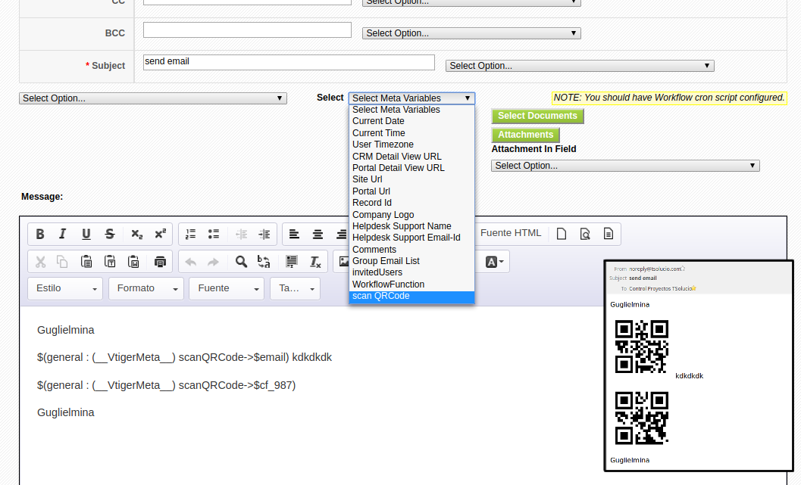
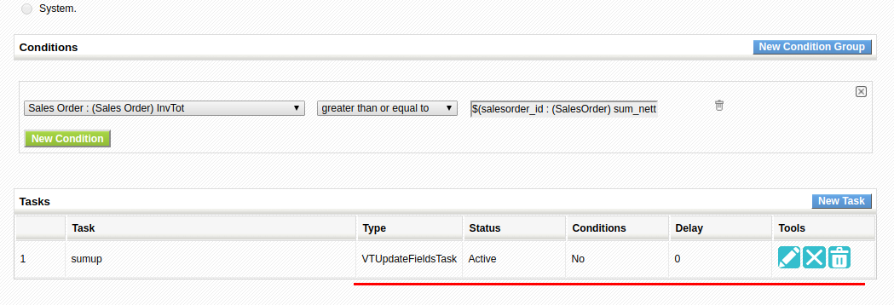
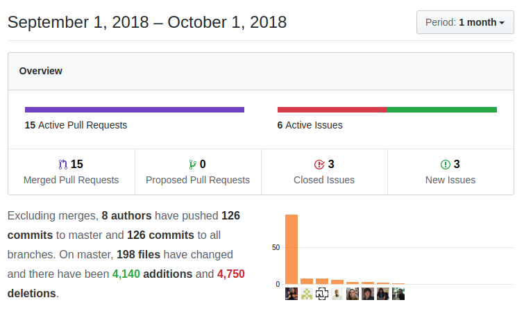

After finishing the coreBOS code standardization project I dedicate the better part of the month to apply some other code optimization tools, refactoring functions and eliminating duplicate code. During this process, we apply a significant amount of changes that will make coreBOS faster and less memory intensive. As usual, a whole set of new features make their way in :-)

===

 ! coreBOS Standard Code Formatting, Security, and Optimizations

- coreBOS Standard code Formatting: cbupdater, cron, CustomView, ListView, Mobile, SMS, Mail, Utils, LayoutEditor, Workflow, WSAPP
- avoid warnings on empty product list price retrieval
- eliminate unused code in WSApp
- delete obsolete Calendar change owner function
- sync Contacts with latest vtlib module code and cleanup code
- eliminate warnings in HelpDesk, Backup, CRMEntity (Permission), Calendar and Workflow
- eliminate obsolete functions in Mass Edit
- reduce memory usage and operations of general JS functions
- eliminate loop and unused variable in Custom View
- eliminate unused code and apply cbSR to edit view
- avoid unnecessary ajax call when changing currency with empty product lines
- eliminate redundant function in InventoryModules in favor of the same function in general.js
- move JS out of inventory modules templates into a script so it gets cached
- eliminate unused code and variable in Reports column totals
- simplify debug message. This is actually the start of the next long-running project I am going to tackle
- use static cache which was being ignored due to incorrect variables
- eliminate duplicate code in filter and search fixing some errors along the way
- call function instead of repeating code in ModTracker
- convert the repeated code in picklists into a function and call it
- eliminate warnings, duplicate and unused code in pricebooks
- call existing function in Reports Save to not repeat code
- convert native validations to support any field object and call from quickcreate simplifying immensely the quick create javascript code
- apply some security checks in web service GetFilterFields method
- Security: PHP Code Injection in images
- fix WSAPP: incorrect variable name was not loading cache and adding other modules mandatory picklists to records

 ! Features and New Stuff
- new Business Map: Detail View Layout Mapping to define block layout for external applications. Probably even coreBOS in the future.
- support for video tag in Image fields: we now show the video
- show image and video in Documents detail view
- permit setting Documents default folder in layout editor when creating
- make the copy links in Detail View copy GenDoc labels instead of field values
- Enhance List Columns map: summary fields
- permit defining columns and width on each multipicklist via Extended FieldInfo map
- Email Validation with ZeroBounce. Return true on timeout and invalid api_key cases
- Workflow expression function "globalvariable" to retrieve Global Variables Value by its name
- enhance Workflow meta variable "comments" to support date formatting
- permit having more than one workflow task of the same type on the same record
- support more closing characters on WorkflowFunction in templates
- add **QRCode Scan** meta variable in Workflow emails 
- support for time on format_date Workflow expression
- Workflow task list enhancements 
- add support for [coreBOSCP](https://github.com/tsolucio/coreBOSCP) in detail view URL via **Application_Customer_Portal_BeingUsed** GV
- change in the process that identifies asterisk incoming call using the PBXManager_SearchOnlyOnTheseFields global variable
- sort Profile by module name
- add a check in the workflow launcher to delete task record from the queue if the task does not exist
- try-catch on individual workflow tasks, trying to reduce lost and hanging workflows while giving more error information
- fix Calendar reports on reminder and recurring events
- restrict the size of module picklist for capture fields (uitype10) in order to not break the layout
- make city fields and user_name portal info field bigger in database
- fix Contacts to correctly give upload error on edit and not able to write file
- fix related list delete action for emails
- fix Detail View copy link for capture fields (uitype10)
- support multicurrency prices in product line autocomplete
- add support for special related list blocks like ticket or potential history
- open related list with slash bars in name by eliminating jquery for vanilla JS
- fix error in web service query on Document Folders when the user that created it is deleted. Now we assign a new owner when the user is deleted
- set correct comparison value for validateImageFile
- fix vtlib:cron to correctly return hadTimedout value
- fix Workflow: send correct reference object to check condition, this was a tough bug to squash. Thanks Luke

 ! Developer enhancements
 - add support for defining cbcustominfo fields via field mapping business map
 - add setUser method to WSAPP in order to permit unit testing
 - fill layout section for ApplicationFields block type in the Detail View Layout Mapping
 - hide DisplayType 4 fields on create
 - get correct Documents name if filename is empty but the file exists: missing variable assignment
 - do not try to duplicate disabled modules in Duplicate Workflow task
 - add field ID for checkboxes and coreBOS custom info fields (cbcustominfo) in Edit View
 - fix and optimize picklist translation based search
 - support for displaytype 2 and 4 in picklists and reports
 - Enhance validation service to hold many validation rules indexed by field which is better than having to create different maps for each rule in the same field.
 - eliminate uitype 116 which was not being used
 - Eliminate UIType 75 and 81 in favor of uitype 10: vendor on products and Purchase Order
 - Validating onlyonmodule custom link node correctly
 - Enhance GetFilterByModule was not returning all the filters and we add more information about each filter
 - fix Web service Get related records query generator to support user information
 - enhance Workflow: if the module of record launching the task is deactivated we do not launch the task

 ! Mobile
- fix create timecontrol and documents icon from Mobile related list view
- Set the actual date time to date_start and time_start fields in Mobile Time Control module
- fix web service Project reference error in Mobile
- use a class in MailManager to reduce code repetition in Mobile extension

 ! Others
- Merge Events and Comments when merging contacts
- update install database
- i18n translate hardcoded strings in Calendar and SMS
- i18n Campaign pt_br

**Thanks for reading.**
