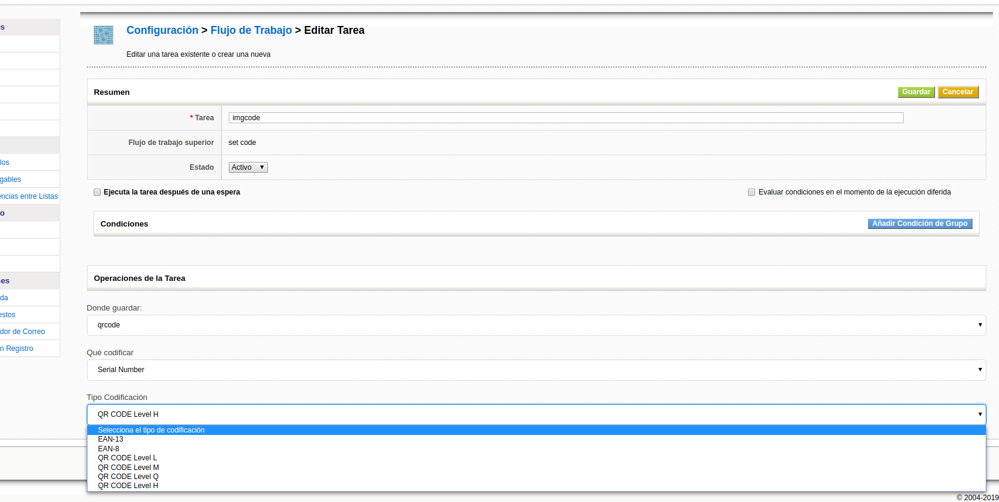
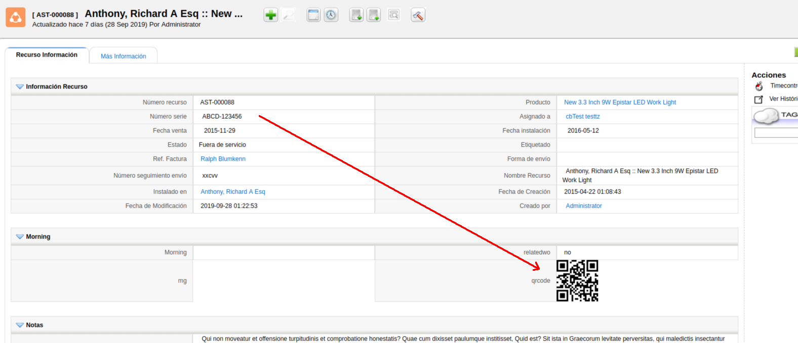
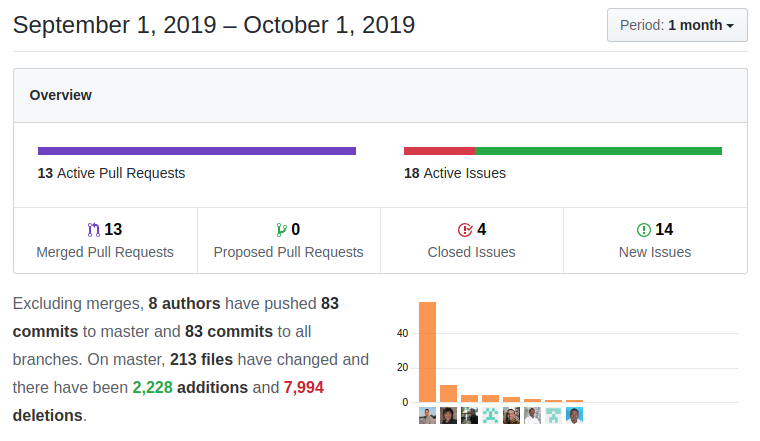

A month full of new features and functionality while we keep up the pace. Very nice!

===

 ! Features/Implementor

- new global variable **Attachment_ShowDownloadName** to show name and download link when showing an image field
- some nicer formatting and messaging to people receiving the CSRF error. Thanks Luke
- add support to import Project Gantt chart into GenDoc document with **Project.GanttChart**
- show filter column specification in Layout Editor properties to help construct maps
- add element **rule** in Field Mapping business mapping XSD validation
- sync filter create and edit with View Permissions module
- Active Directory and LDAP fixes and new global variable **User_MandatoryAuthenticationSQL**. Thanks gaardam

 ! Menu Enhancements

- debug mode will show menu entry order. It can be activated by adding this to the URL: **&menudebug=1**
- reorder menu action: **action=Save&module=evvtMenu&evvtmenudo=fixOrder**
- fix to correctly reorder menu entries on item delete

 ! Generate image workflow task

Mario adds a new workflow task that converts any field value into a QR or EAN image code and saves it into an image field. This permits us to convert serial numbers or any other field value into a scannable image. Then we can use this field in GenDoc or reporting to create labels or product listing for inventory or warranty control, among other usages.

 ! Partial Sales Order to Invoice conversion control

Kiko adds functionality that permits us to convert a Sales Order into an Invoice various times and control the number of units pending in each conversion, so we can create multiple invoices from the same sales order with the right amount of units at the end.

- **Inventory_Check_Invoiced_Lines** global variable that activates the functionality
- Each time a sales order is converted the pending number of units is controlled and set
- If there are no units left to be added the new "Invoiced" field is marked
- In the Invoice you can indicate more or fewer units than are pending:
  - If you put less, the pending units are updated
  - If you put more, the pending units are set to 0
- When you edit an invoice related to a sales order, the units are also controlled with the same logic as explained in the previous point
- If a sales order has no more units to be invoiced, you will not be able to create the invoice
- Recurring sales orders are NOT affected by this functionality

Other cases which need decisions and attention:

- Decide if the [Mass Grouping Extension](https://corebos.com/documentation/doku.php?id=en:extensions:extensions:minvmods2invmods&noprocess=1) needs to be enhanced with the functionality
- Add the same functionality and control when capturing a sales order directly in a new invoice
- Control the change of a sales order in invoice edit. So when we edit an invoice and select another sales order we have to undo all the changes to the previous sales order and update the new one
- Control deleted invoice lines
- Control the elimination of an invoice

 ! Developer enhancements

- add HelperScript to convert coreBOS database to another timezone including time control support
- add support for the execution of javascript validation functions in detail view inline edit and simplify the finishing process in this case when DeveloperBlock widgets or functionality exist
- add new parameter **updatefields** in **upsert method** that permits us to indicate the set of fields to be used to execute the update in the case they are different than the set of fields to be used in the create
- Continuous Integration support with [gitea](https://gitea.io/)+[drone](https://drone.io/)
- add missing javascript files to Continous Integration checks
- Continuous Integration: always sort files the same way and support custom modules and scripts by adding them to the **cifiles.custom** and **cifilesjs.custom** files

 ! coreBOS Standard Code Formatting, Security, and Optimizations

- coreBOS Standard code Formatting: Autocomplete, GenDoc, GeneralJS, Home, List/Custom View, Popup/Search, Project, Settings, Users, Workflow
- ignore [Sonarqube](https://www.sonarqube.org/) scanner work directory
- optimize RelatedList by eliminating empty IF
- security Documents: set default external document protocol to httpS
- security update to the latest version: HTMLPurifier and PHPMailer
- security delete unused demo and test files

 ! User changes and fixes

- fix BusinessQuestion: add error message on failed test SQL
- fix Mass Edit: uncheck picklists with dependencies in mass edit
- fix Attachment/Document: decode (uitype 69/28) file names with special characters (still!)
- fix Autocomplete: bring back keyboard control to autocomplete and try converting to a number before checking type, mincharstosearch was not working
- fix Chart: avoid decimals and higher max value in the scale
- fix CustomView: set module and web service user reference field which were causing a filter save error
- fix DetailView: hide detail view basic action menu by default
- fix GenDoc: Convert number to EN format for number to string conversion
- fix InventoryModules: product autocomplete capture when account/contact are not present
- fix ListView: correctly show special list uitypes by adding 3313/3314 and moving normal picklist last
- fix Popup: more accurate retrieval of last created register
- fix Search: permit searching on entityid field for special modules in advanced search, necessary for popup creation
- fix QuickCreate: align action buttons and eliminate warning in products
- fix Calendar Related List creation: set default related list with Calendar to get_activities
- fix Scheduled Reports by adding missing LoggerManager Class
- fix Reports: report edit was losing stored data on edit
- fix Reports: Correct quotation on query fields when calculating Totals on Inventory Modules
- fix Users list view paging
- always show evaluate conditions and add delayed to explanation in Workflow tasks
- validation of workflow module and web service module before execution in web service execute workflow method
- reevaluate Workflow condition adjustments, especially to make clearer the functionality in the case of queued tasks
- sub/add days and months Workflow expression functions fixes to work with user formatted and empty dates
- Home **Default widget** setting had some fields from the aggregate widget
- eliminate background image in Home widgets
- eliminate empty table navigation row in Related List
- correct syntax error in CSS Themes and apply formatting
- **Continuous translation effort:**
  - add a translation for a hardcoded string in Home
  - cleanup Accounts en_us file and translate to it_it
  - translate new CSRF page to es_es, es_mx
  - cleanup ISO characters and set correct set of labels in Import
  - Home and Reports pt_br. Thanks Slemernet

**Thanks for reading.**
