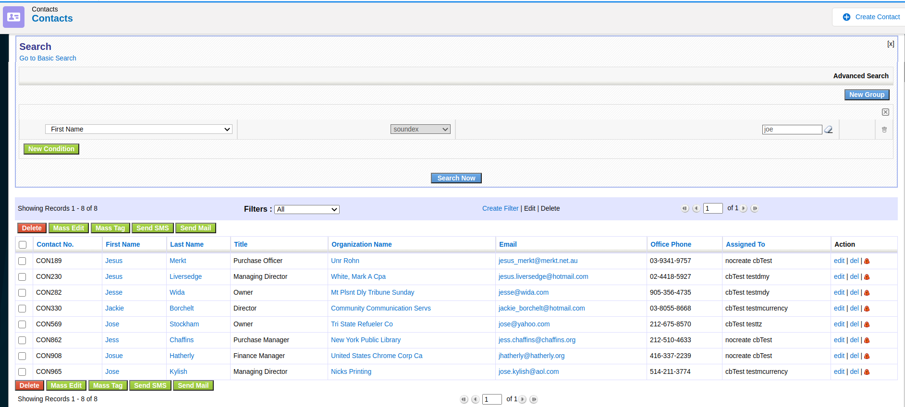
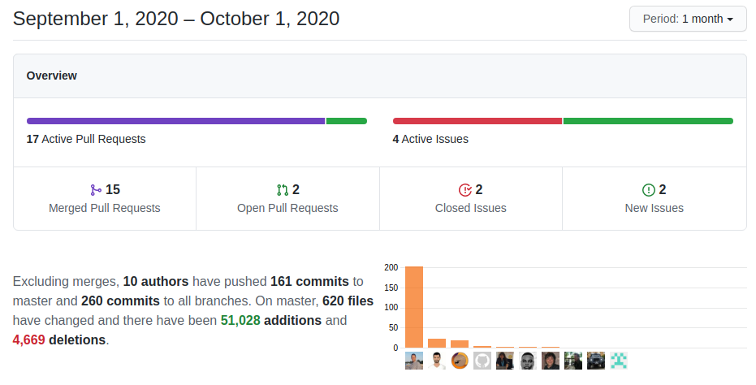

Some really useful user and implementor features and a rich set of global variables land this month while we wrap up some functionality that arrived last month and we keep on adding features and functionality to the workflow system and web service API. Amazing progress!

===

 ! Features and Implementor/Developer enhancements

- Notification Panel. A new emerging sidebar where we can centralize all sorts of application notifications. Accessible also from the top bell notification button, it is the first step towards a standard way of catching the user's attention about certain events.
  - support for calendar events
  - show notification panel on a new notification and click
  - **Calendar_Notification_Sound** global variable. when a new notification arrives a sound is played, this variable permits us to customize that sound
  - refresh notifications button
  - notifications translation fixes and make notification box smaller

- **Application_Textarea_Style** global variable, permits implementors to adapt text areas to their needs
- **Inventory_Comment_Style** global variable, CSS style comment box, permits implementors to adapt text areas to their needs
- **Import_LeaveUserReferenceFieldEmpty** global variable. User reference fields will be set to the user importing the data if the value is empty or the user does not have permission to make that assignment. If this variable is set to 1 the field will be left empty if it is empty.
- standardize popup screen size throughout the application and add global variables to establish width and height: **Application_PopupScreen_Width** and **Application_PopupScreen_Height** represent the percentage of screen width/height that popups will use.
- Business Map based values combobox for input fields. this permits us to define a set of "recommended" values for a text field without forcing the user to choose from a picklist, so the user still has the option to enter any value if they need to.
  - change Field Information Business Map to support features with just values, no need to separate per module to make it easier to create combobox entries

- add soundex and regexp conditions to query generator

- scheduled reports with CSV+Excel attachments
- set account/contact from business map before hardcoded values in Sales Order
- set account/contact when creating a Sales Order from a Potential
- add support for HelpDesk comments changes in ModTracker
- getFirstFieldForModule function: returns the first uitype 10 field that relates two modules
- Business Question CSV File export
  - enhance the formating of column value based on user input
- add check in vtlib to set read-only metadata correctly if not given
- Test and Debug Emails with [Inbucket](https://www.inbucket.org/).
  - **Debug_Email_Send_To_Inbucket** if set to the URL of an Inbucket service ALL emails sent from the application will be sent there. This permits us to safely test all our email sending functionality, even with real client emails, and see the ultimate result that the clients will see while being sure that we won't actually send any emails to anyone.
  - Override the setMailServerProperties with the contents of the Inbucket global variable
- Decision Table enhancements keep arriving as we fine-tune the RAlidine project
  - Decision Table GUI Generator
  - better decision table testing
  - decision table generator, fix error and translate to ES
  - editor translate module picklist
  - fix error loading decision table editor
  - save map from the generator
  - sort labels, active tabs

 ! Workflow and Web Service

As usual, these two areas of coreBOS get attention every month. In our vision of a solid business operating system, we understand that a powerful API and business automation software are a must, so here we go again:

- Workflow
  - **Generate Report task** this workflow task permits us to generate a Report or Business Question and save the results into a file that can be passed to subsequent tasks to be processed. This task integrates the Reports Scheduled task into the workflow system.
  - **Send File task** we can now send files to external locations. We can generate a file from a report or business question and send that file to an external location like Google or Amazon Storage, FTP, or some other directory among others.
      - add Gaufrette library, which is how this task sends files
      - install Credentials module which saves the access information we need for each supported service we want to send files to
      - add expressions to send file task
  - filter inactive workflows from scheduled and RAC workflows
  - show assigned user fields in the field list. you could already use them but they were not showing
  - additional conditions on existsrelated and allrelatedare
  - add JSON encode/decode and array implode/explode to expression language
  - regular expression operator for expression language
  - add parentrole, parentrolename, and rolename to getCurrentUserField
  - balance user queue when calling scheduled workflow
  - correctly push and pop user stack in all tasks
  - checking referenceField for expression conditions
  - expression query language equality support
  - getCurrentUser information functions base on current user variable not user stack
  - inventory lines support for standard relations on any field
- Web Service
  - add role information to user data responses
  - return full user data through the query language. now any user connected to the web service API can launch queries in the Users module to retrieve all their information. Only administrator users will be able to query information about other users
  - return users and groups in Describe based on the **Webservice_Describe_ReturnUserList** and **Webservice_Describe_ReturnGrouopList** global variables. These variables come in handy when we have installs with hundreds of users, since all user fields return the list of supported users, the Describe response is very big with a lot of redundant information. You can set the two global variables to reduce the amount of information and use getAssignedUserList to retrieve the information once.
  - add support for ListColumn map in getRelatedModules
- fixes
  - validation of mandatory fields in workflow editor (lost with page header change)
  - recover Create Entity class name and eliminate EOL spaces
  - remove unused VTCreateEventTask
  - report query and javascript translation issue
  - resolve formatting of scheduled workflow time
  - resolve the display of substring for string with spaces
  - visibility on method __contruct
  - correctly reference user cache in record exists function and minor optimization
  - do not execute already executed workflows set to run ONCE
  - do not mix database access methods
  - set currentModule global variable for query
  - change global variable names so they do not collide in scope in web service Query parser

 ! coreBOS Standard Code Formatting, Security, Optimizations, and Tests

- MySQL version 8 support in Workflows (change empty time conditions)
- PHP 7.4 support
  - change Calendar instruction to support 7.4 and eliminate warnings
  - change each into foreach in graphical Calendar
- coreBOS Standard Formatting
  - mark get_select_options function as deprecate
  - remove unwanted white space
  - document Inventory function to eliminate false code sniff and unindent some lines
  - eliminate CSRF warning on mass edit
  - eliminate warning in Menu
  - eliminate warning and change product delete icon in PriceBooks
- optimizations
  - no need to trim forward slashes in file names anymore as they are being substituted now
  - optimize ListView condition to benefit from short-circuit logic and eliminate specific calendar code: it is a normal module
  - refactor ListView getFirstModule after adding unit tests
- Security
  - sanitize Filenames, replace / by _ to prevent malformed paths
  - set correct file permissions in Business Map
  - set documentation help link to httpS
  - protect Cron/Google directories access
  - strip embedded PHP code from images
  - set google map URL to httpS

 ! Others

- move activity reminder to the new calendar module
- set current user object to send **Two Factor Authentication** code by email
- show error in **Two Factor Authentication** if the current user cannot write to global variables module which is necessary (this should be saved in settings)
- application javascript
  - compare undefined correctly
  - eliminate warnings on undefined module and incorrect ajax response
  - return default GlobalVariable value if user and module are not defined: usually during install
- eliminate javascript error messages detecting empty variables in Autocomplete
- Google calendar sync fixes: notification path vendors problem and update calendar from google to coreBOS time start end problem
- eliminate calendar references from the database: Workflows, Global Variables, related fields, and Notifications
- get calendar global variables with cbCalendar context
- save 12/24 view setting in Calendar
- set default minute span for modules with only one-time field to show on the calendar
- show no Calendar tasks if none are pending
- add more options for Google authentification in Calendar
- load random color library in Dashboard where it is still used
- take an eliminated file out of CI check
- fix wrong "type of data" on GlobalVariable blocked field
- terminate import inventory records infinite loop when importing one record with an error in the data
- delete obsolete reference to vtiger_inventory_tandc which was breaking Inventory Modules imports
- no limit on records in coreBOS command-line import: no batch mode
- avoid losing inventory lines when saving through the save method
- Taxes:
  - send taxid for shipping tax status change
  - use correct variable input name for percentage
  - send taxname to event filter
  - change double quotes
- Leads calendar conversion: rename and document function, add support for new calendar events
- eliminate whitespace in Mail Converter file name to get the size
- complete support for new calendar module in MailManager
- fix quickcreate screen with custom javascript code in MailManager
- use the maximum height of the Popup window
- load record module javascript in QuickCreate screen
- load vtlib javascript functions for global variables and executefunctions during the install process
- get boolean value for checkbox condition evaluation in Field Dependency
- correctly format SendGrid log message variable to support arrays
- add some padding in Shipping Tax settings
- make role field much longer
- correct module "fill in" due to copy/paste error in Record Set Business Map
- add **"generate map"** access on list view. as more and more maps get their generator we add this month a business action to take us directly there from the list view
- Reports
    - use **Export_Field_Separator_Symbol** global variable on CSV report exports
    - add time validation for scheduled reports: not empty
    - CSV export was setting filename with incorrect quotes
    - eliminate Backward Compatability code that is not needed anymore and references to deleted Events module
- Business Question editor
    - set correct main system module on builder edit
    - empty related list for actor modules
    - add module related fields in edit mode
    - correct if-else template in builder
    - prohibit further execution on empty values
    - translate values in the grid
- constant translation effort:
  - Decision Table
  - Debug_Email_Send_To_Inbucket Global Variable
  - QueryGenerator soundex and regex
  - Reports/Workflow/Settings pt_br. thanks!
  - send file and generate report workflow tasks

**Thanks for reading.**
