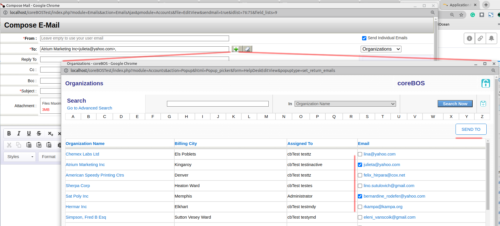
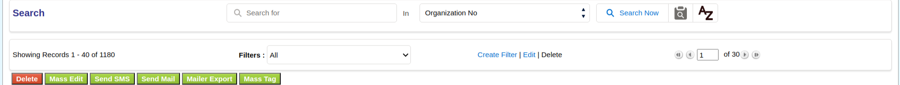
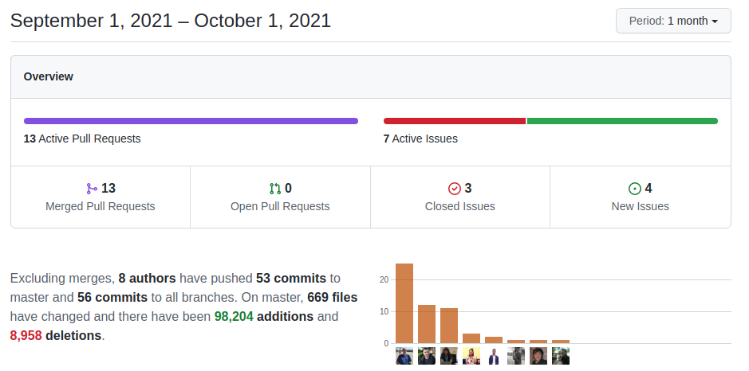

September 2021 found me visiting our team in Tirana. A professional, personal and emotional experience that I needed much more than I realized. I can't express in words what it meant. Thank you!!

What that meant for coreBOS is that I was concentrated on a whole bunch of other projects and the set of changes this month is small. Small as in "coreBOS small", we still get a whole bunch of functionality and features!

===

 ! Features and Implementor/Developer enhancements

- new [Application menu Business Map](https://corebos.com/documentation/doku.php?noprocess=1&id=en:adminmanual:businessmappings:applicationmenu)
- add expression evaluation support in workflow aggregation function conditions for query on same module
  - we could do for example: `aggregation('sum','cbBonusPayments','bonuspmntvalue','[id,n,20700]')`
  - but we couldn't do `aggregation('sum','cbBonusPayments','bonuspmntvalue','[id,n,accountname]')` where `accountname` would be evaluated to it's real value in the context of the record triggering the workflow
- signed notifications: we add a security check to the coreBOS notification entry point. Some services support sending a token or password to prove that they are who they say they are. You can now configure this when setting up the notifications service. We have implemented and tested the functionality with SendGrid but it has been done in a generic way to support any type of validation system.
- LDSModal: Allow overriding the text on the cancelbutton
- Stripe integration
  - add stripe library, configurations, and web service
- allow multiple selections of email addresses from popup listview

- New filter code and view (LDS based)

 ! coreBOS Standard Code Formatting, Security, Optimizations, and Tests

- coreBOS Standard Formatting: eliminate warnings initializing vars, eliminate useless code and comments, format code
- Eliminate technical debt
  - eliminate unused files in SendGrid integration
  - reduce cognitive complexity in ExecuteFunctions
- Refactor and duplicates
  - findup: eliminate duplicate code
  - refactor in new Filter code
  - show error message
- Documentation:
  - function headers, and comments
  - non-stop wiki enhancements
- Optimizations
  - reduce SQL columns, eliminate temporal variable and calculate value only when needed in QuickCreate
  - optimize loops, direct return results, and change time validation in new filter code
- Security
  - update DOMPurify to 2.3.2
  - move and update SendGrid library (composer based)
  - update libraries with composer
  - change file permission
- **Unit Tests:** keeps getting more and more assertions
- **CI Github actions** Lorida converts our travis pipeline to Github actions and adds support for executing the unit tests also in the same process. Wonderful!

 ! Others

- create XSD for Kanban Business Map
- update import Business Map by adding new elements
- fix Workflow programmed task SQL conversion error for date functions
- Webservice describe translate field labels as per the logged in user
- support for records with empty entity field (which shouldn't happen) in WebDAV
- use complete coreBOS path to load file for systems that do not permit dynamic changes in import path (selinux)
- check Master-Detail edit/delete permissions for records
- current record id is missing in Master-Detail edit view
- use from_email_field if it's set to send test email
- fix GenDoc PDF image icon and save PDFLinks correctly
- ModTracker webservice permit table with compound primary key
- update profile and group settings to LDS
- format parameters in Utilities saveSettings
- fieldid is ambiguous in query
- show error for URL mismatch in mass edit (CSRF error)
- update install database with latest changesets after testing install process
- Translations
  - add URL mismatch translations
  - missing labels
  - pt_br new stings and SalesOrder
  - stripe

**Thanks for following.**
