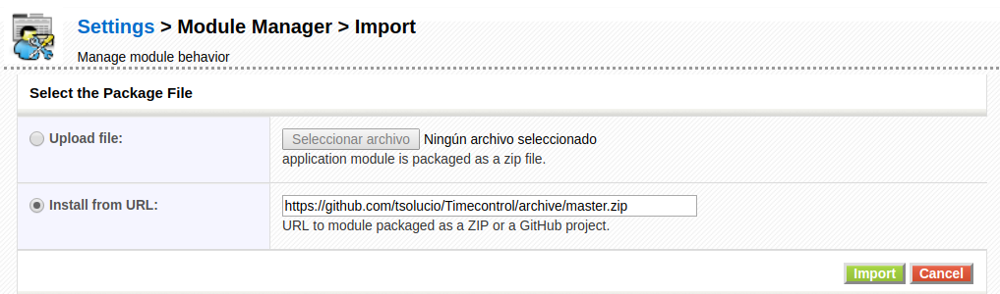

Management and knowledge of the time spent by our employees is directly tied with the rentability of our company, but now that many countries like Spain have passed laws that enforce them to register this time I thought it was a good time to write about how coreBOS has been doing this since 2006!

===

When the coreBOS seminal software was born in the late 90s its main goal was to control the time we were spending on the tasks of our clients so we could invoice them accordingly. That version was very lacking considering what we have now but it fulfilled our needs.

A few years later we arrived at vtigercrm and our first task was to add [**time cards**](http://forge.vtiger.com/projects/tttimecard/) which turned out to be a spectacular success. Later, as vtiger CRM advanced, we created the time control module which supported all sorts of business requirements. This time control module, with some enhancements, is what coreBOS uses to manage time today.

The time control module is open source and [available on GitHub](https://github.com/tsolucio/Timecontrol). You can install it easily copying the URL into the install module section in coreBOS.

Time control has two satellite extensions, one is a statistical/reporting tool named [TCTotals](https://github.com/tsolucio/TCTotals) which serves the purpose to **accumulate total time per user per day.** You do not have to do anything except install and report, the module takes care of all the rest alone.

The other extension is for invoicing time records and is named, very originally, [TCInvoicing](https://github.com/tsolucio/TCInvoicing)

In the next video, I explain a little how these two extensions work and also present the web app.

[plugin:youtube](https://youtu.be/YboQxXhcZII)

! Employee Time Register

The new Spanish regulation about employee time registration obligates all companies to keep a complete log of when each employee enters and leaves his workplace, even the breaks must be registered.

Doing this in coreBOS with time control is easy, simply have each employee create a time control record when they start working and stop the timer when they finish. They will have to do the same thing every time they start and stop. That's it!

Additionally, our mobile UI has full support for the time control module, so you can use it also.

You will be able to report on individual time per user or total time per day either using time control itself which has this value or using TCTotals.

Now, that we have a place to save all the time logs we can start talking about alternative ways to create the records. For example, most biometric readers that you can purchase will permit you to download a CSV file of the logs, so all you have to do is import that CSV into the time control module in order to save it for the four-year mandatory time span. We could also create a program that listens to the biometric readers events and creates the records via web service.

Thinking of external application alternatives we created a mobile-friendly offline web app that will permit your users to log time while they are anywhere (even in the office) and relate these records to the projects they are working on which will serve us not only for legal purposes but also for invoicing. You can access this web app here 

[Time control Mobile Web App](http://coreboscrm.com/tcs)

In our company, TSolucio, we have been using time control for many years and have a slightly modified version of the web app above that accommodates to our specific needs so feel free to contact us if you need any customizations.

! External References

  * [Time Control documentation](http://corebos.com/documentation/doku.php?id=en:extensions:extensions:timecontrol&noprocess=1)
  * [Time Control module on GitHub](https://github.com/tsolucio/Timecontrol)
  * [Time Control Totals module](https://github.com/tsolucio/TCTotals)
  * [Time Control Invoicing extension](https://github.com/tsolucio/TCInvoicing)
  * [Time Control Mobile Web App](http://coreboscrm.com/tcs)

**Enjoying the power of the coreBOS framework.**

<a style="background-color:black;color:white;text-decoration:none;padding:4px 6px;font-family:-apple-system, BlinkMacSystemFont, &quot;San Francisco&quot;, &quot;Helvetica Neue&quot;, Helvetica, Ubuntu, Roboto, Noto, &quot;Segoe UI&quot;, Arial, sans-serif;font-size:12px;font-weight:bold;line-height:1.2;display:inline-block;border-radius:3px" href="https://unsplash.com/@alexkaufmann?utm_medium=referral&amp;utm_campaign=photographer-credit&amp;utm_content=creditBadge" target="_blank" rel="noopener noreferrer" title="Download free do whatever you want high-resolution photos from Alexander Kaufmann"><svg xmlns="http://www.w3.org/2000/svg" style="height:12px;width:auto;position:relative;vertical-align:middle;top:-2px;fill:white" viewBox="0 0 32 32"><title>unsplash-logo</title><path d="M10 9V0h12v9H10zm12 5h10v18H0V14h10v9h12v-9z"></path></svg>Photo by Alexander Kaufmann on Unsplash</a>
