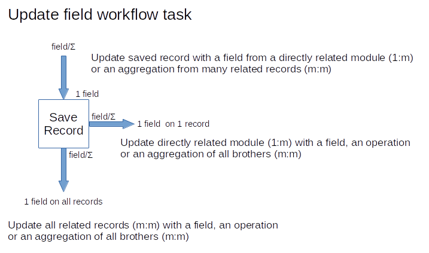

In this post, I will try to explain the complexity of the workflow update field task. As with most things in programming business software it has many more exceptions than you expect.

===

 ! The Basics

We inherited from vtiger CRM a workflow task that was capable of updating fields on the record being saved. In other words, when you save a record you can define a value, a field or a formula that will be saved in a field of the record we are saving.
This is a very powerful and useful feature, especially since the formulas are very flexible (and we have made them even more flexible during the five years of the life of coreBOS), but the task itself was lacking.

 ! Retrieve directly related records

The first enhancement we made was to permit retrieving field values from directly related modules and not only being able to save their value on a field of the record we are saving but also use those values inside the formulas, making these incredibly potent.

 ! Retrieve "many" related records

The natural next step is to access the set of related records of the modules with a "many" relation with the record being saved. For example, let's suppose we are saving an Invoice record. This record is directly related to an Account, so with the previous change, we can access all the fields on that Account. Now suppose you want to access all the payments related to the Invoice record. The relation defined permits us to have many payments related to the Invoice record so we need to introduce a special **aggregation** functon that will permit us to apply some operations in order to obtain only one value. So, we can **sum** all of the payment amounts or get the **maximum** or **minimum** payment. In order to make the aggregation function complete we needed to do two things; one is to add conditions on the selected records of the aggregation, so you can sum only the payments records in status paid or the unpaid ones. The other was to permit operations so you could sum the total cost of inventory lines multiplying the units and cost fields before summing.

[Read this post for some additional information](../workflowaggregation)

 ! Update directly related records

The next enhancement we did was add the possibility to update directly related fields, so you could sum the total of all invoices and save that value on a field on the directly related account or on the record being saved.

 ! Update "many" related records

Finally, there was one last thing we needed to support and that was implemented by [Lorida](https://github.com/loridacito) about a year ago and incorporated into the master branch of coreBOS last month. This function permits us to update the whole set of related records. Continuing the previous example, we could update a field on **ALL** the payment records related to the Invoice being saved, or reassign all the contacts of an account when the account changes it's assigned user.

 ! Conclusion

The complete diagram of possible options looks like this:

As you can perceive, once again, what seemed like a simple task has a rich set of exceptions and possibilities that make it complex to implement and complex to use and understand all the options.

The **important "takeaway"** is that with coreBOS you can implement all these use cases, so if you don't get it working, [look for us on gitter](https://gitter.im/corebos/discuss) and we will try to point you in the right direction.

**With coreBOS you can!!**

<a style="background-color:black;color:white;text-decoration:none;padding:4px 6px;font-family:-apple-system, BlinkMacSystemFont, &quot;San Francisco&quot;, &quot;Helvetica Neue&quot;, Helvetica, Ubuntu, Roboto, Noto, &quot;Segoe UI&quot;, Arial, sans-serif;font-size:12px;font-weight:bold;line-height:1.2;display:inline-block;border-radius:3px" href="https://unsplash.com/@campaign_creators?utm_medium=referral&amp;utm_campaign=photographer-credit&amp;utm_content=creditBadge" target="_blank" rel="noopener noreferrer" title="Download free do whatever you want high-resolution photos from Campaign Creators"><svg xmlns="http://www.w3.org/2000/svg" style="height:12px;width:auto;position:relative;vertical-align:middle;top:-2px;fill:white" viewBox="0 0 32 32"><title>unsplash-logo</title><path d="M10 9V0h12v9H10zm12 5h10v18H0V14h10v9h12v-9z"></path></svg>Photo by Campaign Creators on Unsplash</a>