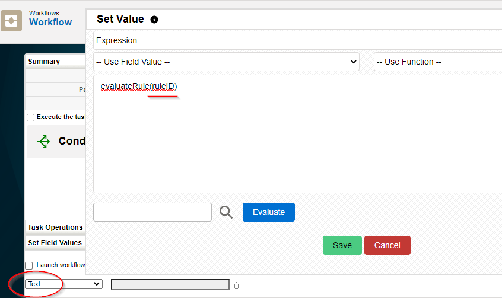
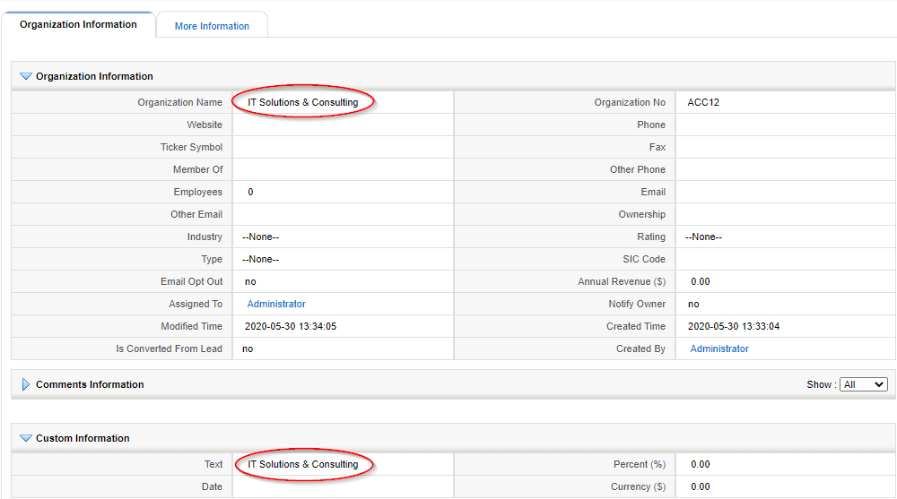
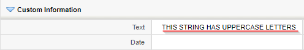
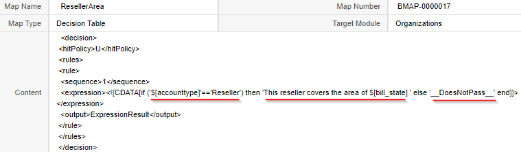
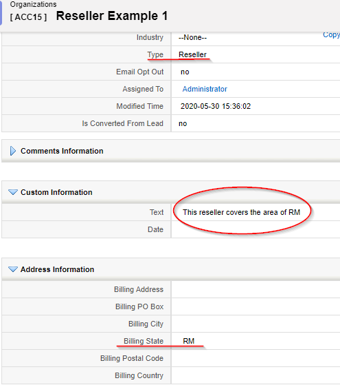
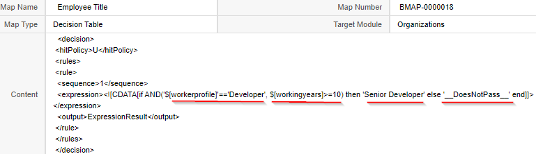
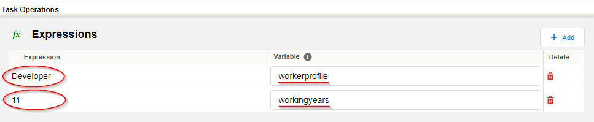
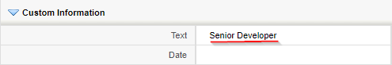

This month we have a great guest post from [Hafsa Laçi](https://www.linkedin.com/in/hafsa-la%C3%A7i-140306141/) where she explains how to evaluate rules and decision tables using the coreBOS workflow system with some new functionality we implemented last month. Enjoy!

===

Good ideas always come to those who are too busy finding ways to make things easier, so here’s to another good idea!

It’s all about executing coreBOS business rules from the workflow system, more concretely, being able to execute a rule against a map through the workflow system, get the result back and display it into a field.

Via this post, we would like to introduce you to the two latest functionalities added to our coreBOS. We will start by explaining how the "**Evaluate Rule**" expression works, and then we will continue by demonstrating how the new "**Execute Expression** task can be used.

 !!! Evaluate Rule Expression

This is an expression that accepts a ruleID (or business rule name), launches it depending on what type it is (Condition Query, Condition Expression, or Decision Map), and returns the result of the rule.

Let's suppose we want to update a custom text field that we have in the Accounts module, through the workflow system, using the Evaluate Rule expression. The view would be like this:

Next, we will show what would be the result of the expression if in the ruleID parameter we put the CRMID of each one of the three types of business rules supported.

 ! Condition Query

Let’s consider a condition query named "Accountname Query" that targets the Accounts module. What this SQL query does is retrieve the Account name and return it.

If we put its CRMID inside the evaluateRule expression, what this expression will do is, look for the map, launch the query, get the account name and save it inside the custom "text" field that we used to show the result. Whenever we will edit and save an Account record, or create a new one, the "text" field will contain the account name of that record, as you can see in the following picture.

 ! Condition Expression

In this case, if inside the evaluateRule expression, we put the CRMID of a hardcoded condition expression named "UpperCase String" that returns as a result a string in an uppercase form, the "text" field will show this result instead. You can see it below.

 ! Decision Map

Here is where the real power comes in. The following picture is an example of a Decision Table Map.

If a record added or modified is a "Reseller" type of record, then in the "Text" field will appear the area this reseller covers. The area will be taken from the existing Billing State field of the Accounts Module. Otherwise, if it isn’t a "Reseller" type of record, the field will show "__DoesNotPass__".

By putting the CRMID of this decision map inside the evaluateRule expression, and creating an account record of "Reseller" type with a Billing State equal to "RM", we get this result in the "Text" field:

The cases above were just random examples to demonstrate that you can basically access the whole workflow system and do anything you need to do with this functionality.

 !!! Execute Expression Task

In the example above related to the decision table map, the variables ‘accounttype’ and ‘bill_state’, are actually existing ones, fields in the record we are saving. This means that we can already fill them with values directly from the Accounts module interface.

Although it happens sometimes to not have value/context for some variables, so one might ask, how can we get values into them? The execute expression task helps us to do so!

Let’s assume that we want to get a result in the same custom "Text" field by evaluating the decision map below.

To do so, besides putting the id of this decision map inside of the evaluateRule expression, we have to give values to the variables ‘workerprofile’ and ‘workingyears’.

We should know that all tasks running in the same workflow, can share the same context. Given that, in the same workflow that executes the evaluateRule expression, we must add a new task named "Execute Expression" in order to load the context to the two variables. The execute expression must come before the evaluateRule expression.

As shown in the picture above, we have added the values to the variables. Now, if we try to launch the map through the evaluateRule, we get the desired result.

You can see all this in action in this next video:

[plugin:youtube](https://youtu.be/uqWQFY5Ey-4)

**Enjoying the power of coreBOS!!**
