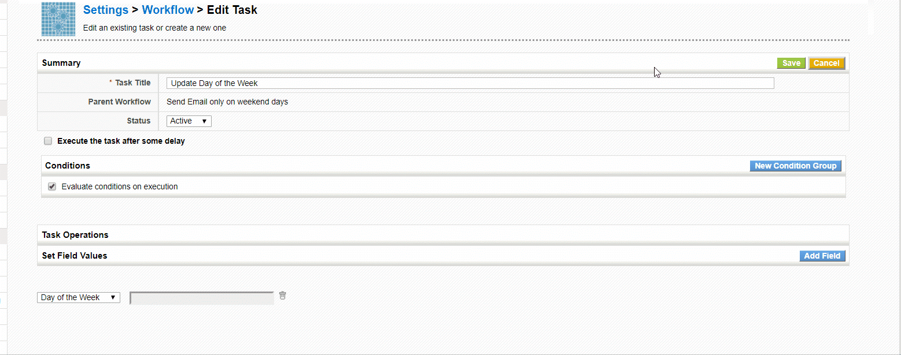

Learn how to send out warning messages for records created on the weekends with the workflow system in this **Guest Post** from our community member [Besart Marku](https://github.com/besartmarku)

===

 ! The Question

How can I have the application send me an email or SMS for tickets created during the weekend?

 ! The Problem

Sending an email or SMS when a support ticket is created using the workflow system is easy, but doing that only for records created on the weekends is a bit more complex and requires some additional magic. Read [Besart's detailed explanation on the wiki](http://corebos.org/documentation/doku.php?noprocess=1&id=en:workflow_weekendwarning) or continue reading to get a summary of the general concept.

 ! The Solution

Our task is to send an email to a group of users every time a Support Ticket is created on specific days (in our case, only weekend days).

The first thing we are going to need is a new custom field. We are going to call it "Day of the week", you can name it whatever you want.

This field will be of the type "number" and it will hold a number from 1-7, representing each day of the week (1-Monday, 2-Tuesday... 7-Sunday).

The whole point is to use it as a condition to launch a workflow (example: if DayofWeek==7, then launch workflow task)

We have to create a new workflow which will send the emails when the conditions we want are completed. If you are new to workflows, [please check this link](http://corebos.org/documentation/doku.php?id=en:workflow_stepbystep).

Our workflow will trigger **only on first save** and have **no conditions**. It will consist of 2 tasks:
  * The first task will update the field "Day of the week" with the number of the current day of the week
  * The second task will send the email

The value in the update field expression is the tricky part. Choose **Expression** from the dropdown list and paste this code at the text area:

```
format_date(get_date('today'),'w')
```

This function will update our custom field with the number of the current day of the week. Please see the GIF below for details.



After saving this first task, we will create another new task which will send the email. Fill the fields with the values you want (email recipients, body, subject, etc...).

And, finally **the last trick** that permits us to accomplish this task without programming: set the conditions ON THE EMAIL TASK, to send the email ONLY if the "day of week" field is one of the values we want it to send on.

This works due to two fundamental rules of how workflow tasks are executed:

  1. The execution order of the tasks is defined and guaranteed. Note that this is not true for the workflows themselves, just the tasks inside a workflow.
  2. The changes of each task are updated and passed to the next task, so, in this case, the email conditions will have access to the day of week field.

This is how the email task conditions look like:


 ! An Interesting Variation of the Same Concept

At about the same time we were doing this post I received a question from a client who needed to convert Service Contracts into Sales Orders once a month depending on the month of the "Start Date" field on the service contract. So I applied the same logic.

I created a "Renewal Month" numeric custom field, filled it with an update field task and the expression:

```
format_date('startdate', 'm')
```
Then I created a **Scheduled Workflow** that launches once a month with the condition:

```
"Renewal Month" equals format_date(get_date('today'),'m')
```

You could even use the "add_month" function to create the Sales Orders with an offset...  **The possibilities are enormous!**

 !!! Thank you Besart!

<br>
**<span style="font-size:large">I trust this will help you make your coreBOS more useful!</span>**

