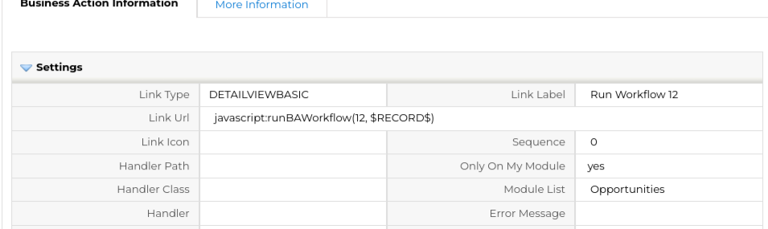
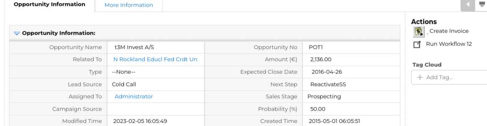
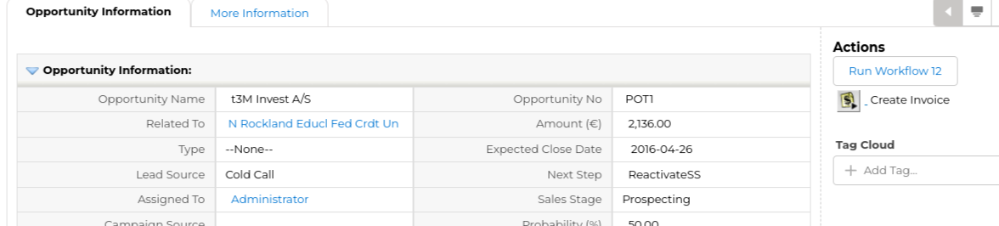
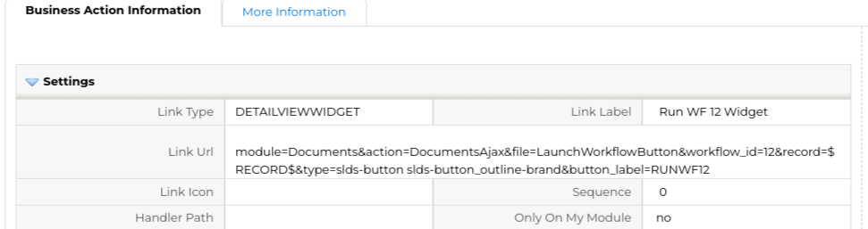
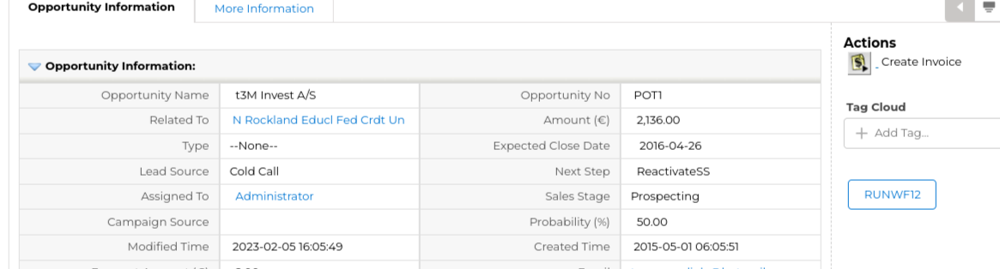
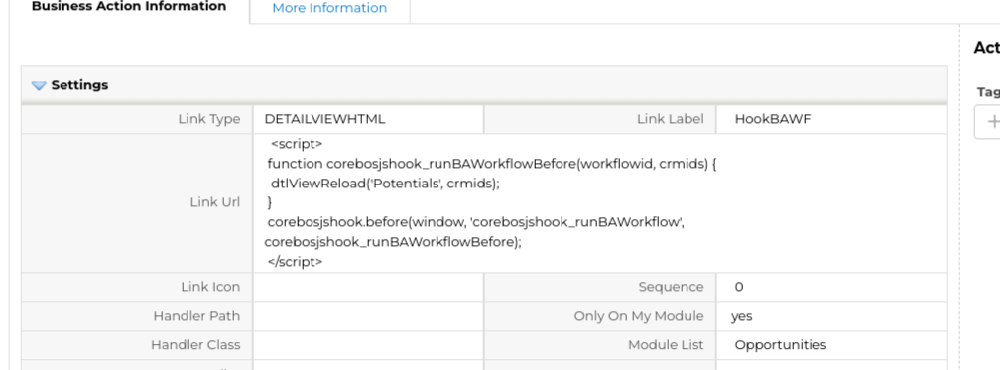
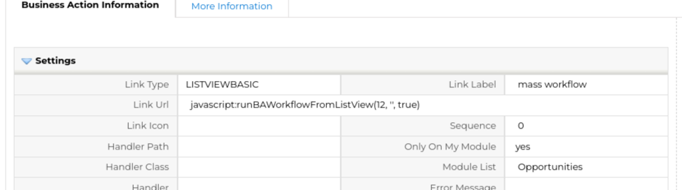
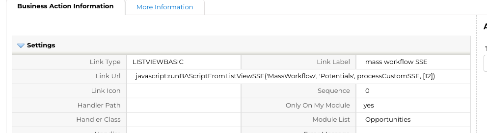
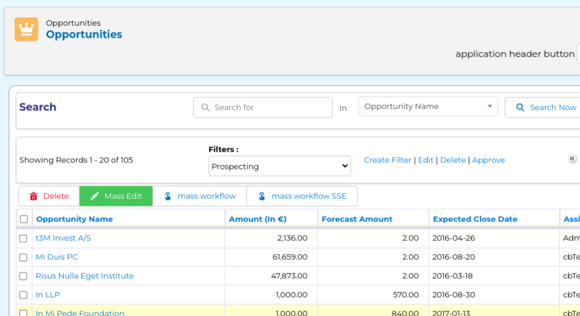
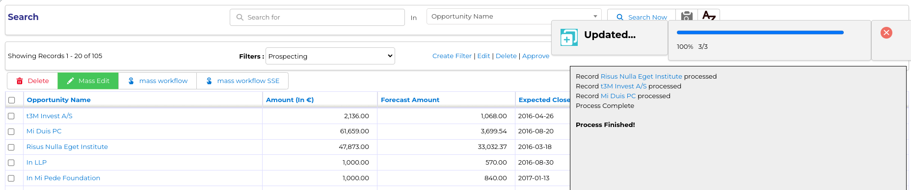

Another "how-to" post. Learn how to add some action buttons in coreBOS.

===

 !!!! Detail View Button

First, we will define a button on the detail view of a record that will trigger a workflow and refresh the view.

We create a workflow that does some action, in this case, I'm going to use an already existing workflow on the potentials module. Potentials have a workflow that updates the forecast amount on every save. This workflow in my test installation is 12. So we can add a link with this business action:

| Field | Value |
|:------ |:----------- |
|Link Type:|DETAILVIEWBASIC|
|Link Label:|Run Workflow 12|
|Link URL:|`javascript:runBAWorkflow(12, $RECORD$)`|
<br>





As you can see it calls an existing function `runBAWorkflow` and appears as a link. We can change that to a button using `DETAILVIEWBUTTON` (at the top) or `DETAILVIEWACTIONBUTTON` (in the action panel) instead



And, in this case, we can also use the **Launch Workflow detail view widget**. The widget gives us more control over the final output.

| Field | Value |
|:------ |:----------- |
|Link Type:|DETAILVIEWWIDGET|
|Link Label:|Run WF 12 Widget|
|Link URL:|`module=Documents&action=DocumentsAjax&file=LaunchWorkflowButton&workflow_id=12` `&record=$RECORD$&type=slds-button slds-button_outline-brand&button_label=RUNWF12`|
<br>





This works, but the action does not refresh the data. To do that we can do two things. [Looking at the code](https://github.com/tsolucio/corebos/blob/master/include/js/general.js#L1493) we see that there is a hook that we can work with. You can read about [how this works here](https://corebos.com/docs_grav/developer-guide/architecture-concepts/corebosjshooks). For our case, we have to add another business action with some JavaScript to listen on the hook and launch the `dtlViewReload` function to refresh the data in the browser.

| Field | Value |
|:------ |:----------- |
|Link Type:|DETAILVIEWHTML|
|Link Label:|HookBAWF|
|Link URL:|below|
```JS
<script>
function corebosjshook_runBAWorkflowBefore(workflowid, crmids) {
  dtlViewReload('Potentials', crmids);
}
corebosjshook.before(window, 'corebosjshook_runBAWorkflow', corebosjshook_runBAWorkflowBefore);
</script>
```
<br>



This code connects to the hook and executes a data reload when the workflow has finished.

The nice thing about this is that you can add any code and logic you want, but if you just want to reload the data the `runBAWorkflow` function has an additional parameter that does that. We just have to add `true` in the fourth position or `refreshdv=true` in the launch workflow widget like this

`module=Documents&action=DocumentsAjax&file=LaunchWorkflowButton&workflow_id=12&record=$RECORD$&type=slds-button slds-button_outline-brand&button_label=RUNWF12&refreshdv=1`

 !!!! List View Button

Now let's see how to do this in the list view. In The list view, we have a different goal, it is a **mass action button** that will affect all the selected records instead of just one as we did on the detail view. As before, coreBOS gives us a function to do this called `runBAWorkflowFromListView` so our business action looks like this

| Field | Value |
|:------ |:----------- |
|Link Type:|LISTVIEWBASIC|
|Link Label:|mass workflow|
|Link URL:|`javascript:runBAWorkflowFromListView(12, '', true)`|
<br>



You can see that we also have the refresh list view parameter (set to `true` in the example above) and [the hook](https://github.com/tsolucio/corebos/blob/master/include/js/ListView.js#L1185) which we can also use to call the refresh function `listViewReload()`.

So the same logic.

There is one more option in the list view which is to execute the command as a **server-side event script** and output the results in the same window the mass edit functionality uses. This gives great feedback to the user and permits us to distribute the work more evenly.

coreBOS gives us all the infrastructure we need to easily execute Server-Side events, basically, you just have to create the backend script and call it using the custom SSE code coreBOS has, but, in this case, executing workflows is so powerful and commonplace that, once again, coreBOS gives us a function to do this, making it even easier. The action executes the `runBAScriptFromListViewSSE` function calling the backend script `MassWorkflow.php` which you can read to see how to create your own SSE code. The business action looks like this:

| Field | Value |
|:------ |:----------- |
|Link Type:|LISTVIEWBASIC|
|Link Label:|mass workflow SSE|
|Link URL:|`javascript:runBAScriptFromListViewSSE('MassWorkflow', 'Potentials', processCustomSSE, [12])`|
<br>







**<span style="font-size:large">Enjoy!</span>**

<a href='https://openai.com/dall-e-2/'>Cover image created using DALL-E</a>