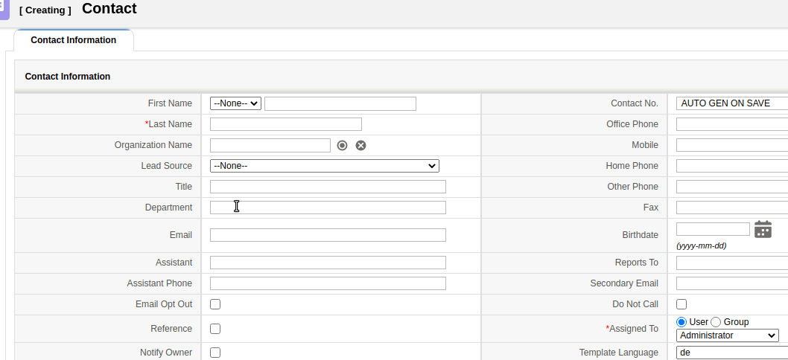

coreBOS has had autocomplete functionality for some time now on various types of fields but a few weeks ago we added another interesting autocomplete functionality so let's review what we can do.

===

Since mid-2017 we have been able to define autocomplete functionality on capture fields, fields that reference another module, and normal input fields. Both these types search for their values from the records in a module. So, we have to define what module we want to get the values from and what fields we want to search on and show when records are found. Finally, we have to define also what fields we want to fill in when a record is selected from the list of values.

We also have similar default but customizable autocomplete functionality in the product and service inventory lines.

You can [read how to set up this functionality in the wiki](https://corebos.com/documentation/doku.php?noprocess=1&id=en:adminmanual:businessmappings:fieldinfo:autocomplete).

A few months ago we added a similar functionality where you can define a set of values that you want to suggest to your users. It is like an autocomplete because it shows values as you type but instead of retrieving the values from another module, it searches in a predefined set of values.

The use case is when you have a text field that should normally contain a restricted set of values. For that, you would create a picklist, but this particular field must permit also the possibility to enter any free text. So, we have a picklist-like field with a set of values we want to have correctly and consistently written in a certain way (not misspelled nor with different capitalization or abbreviations) but we need to permit the user to introduce other values different than the predefined ones if they need to.

Let's define a list of values for the Department field in the Contacts module. We will load three predetermined department names but permit the user to add their own if they need to.

The business map will have these settings:

| Field | Value |
| ----- | ----- |
| Map Name | Contacts_FieldInfo |
| Map Type | Field Information |
| Target Module | Contacts |

And the Content field will contain:

``` xml
<map>
  <originmodule>
    <originname>Contacts</originname>
  </originmodule>
  <fields>
    <field>
      <fieldname>department</fieldname>
      <features>
   <feature>
    <name>combobox</name>
    <values>
      <value>Marketing</value>
      <value>Management</value>
      <value>Human Resources</value>
      <value>Research</value>
      <value>Development</value>
    </values>
   </feature>
      </features>
    </field>
  </fields>
</map>
```

Which results in the autocomplete field you can see in the next animated image.



**<span style="font-size:large">Very useful!  Upgrade and enjoy the power of your coreBOS</span>**
