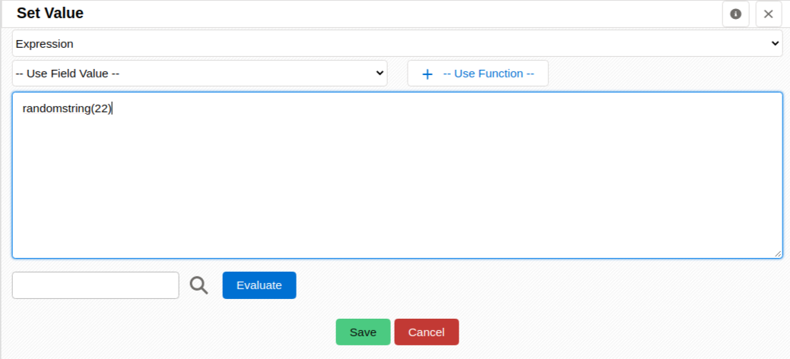

[Three years ago](../automaticupdatetickets) I wrote about what I call the "Back to the Web" pattern. This week that pattern came up twice and we added some functionality related to it. Read on to refresh your memory.

===

The **back to the web pattern** is about sending a link to your client which permits them to access some information in your coreBOS install, either to just see it or to permit them to validate and update parts of it.

coreBOS gives you a lot of ways to send the link to your client. We have support for:

- Email
- SMS
- Whatsapp
- [Desktop/Mobile notification (OneSignal)](../onesignal)
- Mattermost integration
- [Push Notification](../gmppushnotification)
- [Run Web Service workflow task](../runwswftask)

In the [post I wrote three years ago](../automaticupdatetickets), I suggest sending the client a URL with the internal ID of the record you want your client to see, like this

`https://yourWebsite/updateticket.php?ticketid=123&ticketstatus=Resolved`

the issue with that URL is that anyone can easily change the "123" to access information of a record they shouldn't be able to access. We have to add some level of security there depending on the specific requirements of each case, in other words, depending on how sensible the information you are exposing is and what you permit the user to do (update, delete, ...).

One basic protection that **must** be added is to substitute the ID with a random identifier. The procedure to accomplish this in coreBOS is:

- create a new field in the module you have the information to be exposed. Let's call it `External ID`
- create an update field workflow task that fills in this field when the record is created, like the next image

- the longer the random string the harder it will be to brute force another valid value
- use this random value in the notification URL
- in the landing page of the notification URL you will use a web service query to search for the record using the external ID field instead of the real ID, like this

`select * from some_module where externalid='value_from_link';`

- since we will be using the externalid field as a key to search in the module it is probably a good idea to create a database index on it

Now that is a very basic and fundamental change to implement, but it is not really secure. It is just a matter of resources to calculate another valid external ID, and there are people out there that are bored enough to dedicate those resources to find it. In fact, the only difference from using "123" is that you made it harder to find a valid value. So, if the information you are exposing is of some delicate nature you must do some more work.

I am just going to comment on a couple of ideas to get you on your way.

The easiest one is to add two-factor authentication to access the information. When the user clicks on the notification URL, we check if the external ID is valid. If it is, that will give us access to the client information and we can send them another code that they must introduce to get access to the record.

The next option is to create a portal application. That application would require your users to login to the application where you know that the information is restricted to what that user has permission to see and where access is protected in other ways. You can get really inventive with this option.

Our goal here is to add a minimum layer of security without it getting in the way of functionality (as it always is with security).

**HTH!**

Photo by <a href="https://unsplash.com/@anritikhon?utm_source=unsplash&utm_medium=referral&utm_content=creditCopyText">Andrey Tikhonovskiy</a> on <a href="https://unsplash.com/s/photos/return-to-the-web?utm_source=unsplash&utm_medium=referral&utm_content=creditCopyText">Unsplash</a>
  