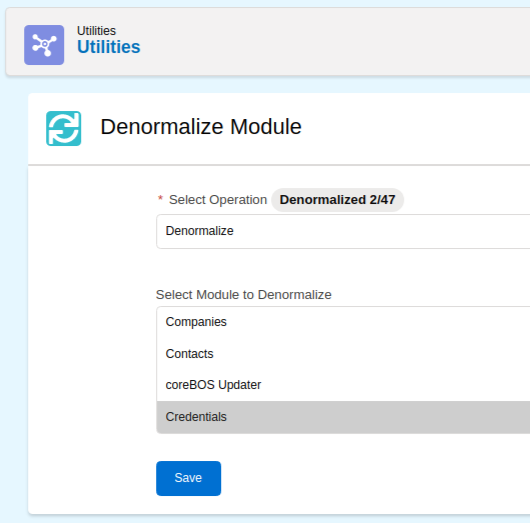
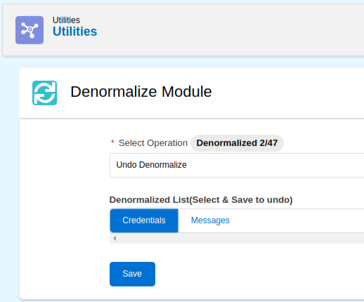

Learn how, when, and why to use denormalization in coreBOS.

===

coreBOS will be releasing very soon a major change in the code structure. A project we named **Denormalization Project**. Let's see what this is about starting with the definition of "denormalization". [Wikipedia defines it very well as:](https://en.wikipedia.org/wiki/Denormalization)

> Denormalization is a strategy used on a previously-normalized database to **increase performance**. In computing, denormalization is the process of trying to improve the read performance of a database, at the expense of losing some write performance, by adding redundant copies of data.

The goal behind this project, for coreBOS, is to eliminate or reduce the bottleneck we have with the normalized data in the crmentity table. The problem is that when we have very large amounts of records in one or more modules, let's say 1 million records in each of two modules, we have a row for each one in the crmentity database table. Let's suppose that besides the 2 million rows we have for the two big modules, we also have another million records between all the other modules in the application. This makes for a crmentity table with 3 million records. When we need to access a module that has 1 thousand records it will have to go through the 3 million records to get the normalized information it needs to work (it's 1 thousand rows). This makes the whole system respond slowly.

The denormalization project will permit us to move the 2 million records from the crmentity table on to the main database table of each module. So we will move the information of 1 million records in each of the big modules onto their main table, reducing the rows in crmentity by 2 million records. After this operation, the two big modules will work without any reference to the central crmentity table making them both independent and a lot faster, but also, all the other modules now have to join on a much smaller (still) normalized crmentity table.

In other words, we are only denormalizing those modules that are causing the issues, all the others keep working the same way they used to work.

Let's talk about the implications of this project.

 ! Developers

The people developing in coreBOS have the biggest impact of the change because it is an internal code change. Before this project we always had to "join" our queries with the central crmentity table, at a minimum to get the "deleted" state of a record. Our queries looked something like this:

``` php
$module = CRMEntity::getInstance('Accounts');
$q = 'SELECT *';
$q .= ' FROM '.$module->table_name;
$q .= ' INNER JOIN vtiger_crmentity ON vtiger_crmentity.crmid='.$module->table_name.'.'.$module->table_index;
$q .= ' WHERE vtiger_crmentity.deleted=0';
```

Now, we cannot guarantee that the "deleted" field will be on the vtiger_crmentity table anymore, it MAY be there, but it MAY NOT be. If the implementor of this particular coreBOS has decided to apply denormalization to the Accounts module, then the deleted field will not be in vtiger_crmentity and neither will any of the other fields in that table be there, the whole row will have been eliminated and the fields will have been moved to the main vtiger_account table. So the query will have to look like this:

``` php
$module = CRMEntity::getInstance('Accounts');
$q = 'SELECT *';
$q .= ' FROM '.$module->table_name;
// NO MORE JOIN WITH vtiger_crmentity, deleted is on the main table
$q .= ' WHERE '.$module->table_name.'.deleted=0';
```

So we have to check if the module we are creating the query for has been denormalized or not and use one query or another depending on the answer. To make this code change a little easier we have added three new properties to the module object:

``` php
public $crmentityTable = 'vtiger_crmentity';
public $crmEntityTableAlias;
public $denormalized = false;
```

The first one indicates the database table where the common information lives for each module. The last one permits us to easily "ask" if any given module has been denormalized or not. So, using those two variables we can change our code like this:

``` php
$module = CRMEntity::getInstance('Accounts');
$q = 'SELECT *';
$q .= ' FROM '.$module->table_name;
if (!$module->denormalized) {
  // if it is normalized we add the join, if not we don't need it
  $q.=' INNER JOIN vtiger_crmentity ON vtiger_crmentity.crmid='.$module->table_name.'.'.$module->table_index;
}
$q .= ' WHERE '.$module->crmentityTable.'.deleted=0';
```

We have used this transformation in parts of the code but it has a serious limitation. If it is a dynamic query that can use any fields in the select clause then it will fail if asked for a central crmentity field. Let's suppose the code adds the "assigned_user_id" field to the query:

``` php
$module = CRMEntity::getInstance('Accounts');
$q = 'SELECT vtiger_account.accountname, vtiger_crmentity.smownerid';
$q .= ' FROM '.$module->table_name;
if (!$module->denormalized) {
  // if it is normalized we add the join, if not we don't need it
  $q.=' INNER JOIN vtiger_crmentity ON vtiger_crmentity.crmid='.$module->table_name.'.'.$module->table_index;
}
$q .= ' WHERE '.$module->crmentityTable.'.deleted=0';
```

if the module has been denormalized the field `vtiger_crmentity.smownerid` will not exist and the query will fail. To overcome this issue we have used an SQL trick that permits us to join on the same table, creating an alias of the main table, like this

``` php
$module = CRMEntity::getInstance('Accounts');
$q = 'SELECT vtiger_account.accountname, vtiger_crmentity.smownerid';
$q .= ' FROM '.$module->table_name;
$q .= ' INNER JOIN '.$module->crmentityTable.' as vtiger_crmentity ON vtiger_crmentity.crmid='.$module->table_name.'.'.$module->table_index;
$q .= ' WHERE '.$module->crmentityTable.'.deleted=0';
```

This _inner join trick_ permits us to support any vtiger_crmentity field as if it still existed on the central table. For example,

``` php
$module = CRMEntity::getInstance('Accounts');
$q = 'SELECT vtiger_account.accountname, vtiger_crmentity.smownerid, vtiger_crmentity.modifiedtime, vtiger_users.first_name';
$q .= ' FROM '.$module->table_name;
$q .= ' INNER JOIN '.$module->crmentityTable.' as vtiger_crmentity ON vtiger_crmentity.crmid='.$module->table_name.'.'.$module->table_index;
$q .= ' LEFT JOIN vtiger_users ON vtiger_users.id = vtiger_crmentity.smownerid';
$q .= ' LEFT JOIN vtiger_groups ON vtiger_groups.groupid = vtiger_crmentity.smownerid';
$q .= ' WHERE vtiger_crmentity.deleted=0';
```

To make this approach easier to program we introduced the other module parameter `$crmEntityTableAlias` which can hold two values depending on the denormalized state of the module and will permit us to substitute directly the vtiger_crmentity hardcoded table name for the property:

`$crmEntityTableAlias = 'vtiger_crmentity'`

`$crmEntityTableAlias = $module->table_name.'as vtiger_crmentity'`

If we have to instantiate the module (as above) because we don't have that object in the context of our code you can also use a new method named `getcrmEntityTableAlias()` which will do that for you and return the `$crmEntityTableAlias` property you need.

Finally, I have to note that these changes described here only apply to custom code or direct database access. If you are using QueryGenerator, vtlib code, standard modules, web service API, and other system tools and functions you do not have to worry. Your code should just keep working. We already made the necessary changes there.

 ! Implementors

To denormalize a module we must access the `Utilities > Denormalization` section, select the action "Denormalize", a module and click save.



To normalize a module we must access the `Utilities > Denormalization` section, select the action "Undo Denormalize", a module and click save.



 !! NOTE:

Make a backup before applying either of these steps and test it first on a validation install to make sure you don't lose any data. This is a delicate process as we are moving big amounts of information around and deleting rows in the database.

> **Please make a copy of your database!**

 ! Users

Users of the application should see no change at all. Everything should just keep working as before but faster.

 ! More information

For some operations we needed to have a central table with some common fields, so we created a new table `vtiger_crmobject` that holds this information:

```
	crmid,
	cbuuid,
	deleted,
	setype,
	smownerid,
	modifiedtime,
```

Maintianing this table is where most of our "extra write time" has gone to. As the denormalization definiton states, we trade faster reading for slower writes. In general, that does not apply to our change because we are "just" saving the information on another table, but we do spend more time maintaining the new `vtiger_crmoblect` table.

Also, we needed to easily know the list of denormalized modules so we added two fields to the `vtiger_entityname` table that holds this information

```
isdenormalized,
denormtable
```

**<span style="font-size:large">Ask for help if you need it. Enjoy!</span>**
