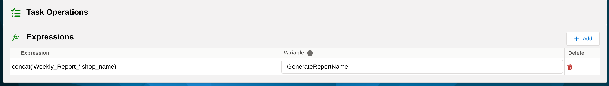
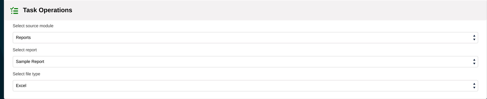

We are thrilled to announce that we are starting a **series of blog posts** about the coreBOS Workflow Tasks.

The first one to get the spotlight will be the **Generate Report Task**.

===

This workflow task allows you to generate any report or business questions that you already have on your coreBOS using the workflow system.
You can implement any conditions you want and send it via mail or a set of other platforms.

Below we will follow a step-by-step approach to the implementation of the workflow.

!! Execute Expression  Task

Context Variables: __GenerateReportName__ and __GenerateQuestionName__

These two variables hold respectively the name of the Reports/Business Question you want to generate. The context is passed to the Generate Report Task.

!! Generate Report Task

* **Select source module:** Reports/Business Question
* **Select Report:** Choose the BusinessQuestion/Report you want to generate.

You might be asking why we created the context variable in the first place when we are choosing a Report/BQ here.

The report you select inside the Generate Report Task will serve as a placeholder and completely be ignored if any value is passed from the context variables;

If a Report/BQ with the value that the context variables hold can't be found, the report set here will be sent.

* **Select File Type:** Supported formats: CSV/Excel/PDF

!!! Use Case:

Let's say you have a set of 20 shops and got one report for each of them on coreBOS. You want to send weekly (any desired time-frequency) customized template mails to all 20 shops. Note that we have a module to save the shop records and correspondences (they aren't users).

The setup would be as following:

1. Create an execute expression task, and valorize the GenerateReportName variable with the expression you want, something like `concat('Weekly_Report_',shop_name)`. So, each report you have has the shop name on its title.

2. Create a Generate Report Task. The report you choose here will only serve as a placeholder.

3. Create a send mail task with the mail template you want and the recipient you need. (2 things that you don't get to achieve when you schedule reports from the Reports module).

If the send mail task follows a Generate Report Task, it will understand that a report gets generated and sends it for you without extra action.

!! **Important Note:** You can set up more than 1 Execute Expression/Generate Report Task mail on the workflow. As long as you put the send mail task last, all the reports will be generated and attached to your mail.

**Global Variable:**

Report_Send_Scheduled_ifEmpty. If you don't want the mail to be sent if the report generated is empty, you have to create this GV and valorize it to 0. The default value is 1.
4. Schedule your workflow, and you are done.

The example we described was using Reports, but the real power comes when we use Business Question. Now we have a way to share our Business Questions with everyone who needs them, just like we do with reports. In addition, we have added support for Business Questions through the File Type, which will spotlight the upcoming blog post. Stay tuned :) !!

**Thanks for reading.**

!!!! Closing note to the post and series

What can I say? Humbled and honored. Thank you so much for starting this series and taking the initiative to do so. I am more than happy and look forward to reading all of them :-)

Cover photo by <a href="https://unsplash.com/@isaacmsmith?utm_source=unsplash&amp;utm_medium=referral&amp;utm_content=creditCopyText">
Isaac Smith</a> on <a href="https://unsplash.com/">Unsplash</a>