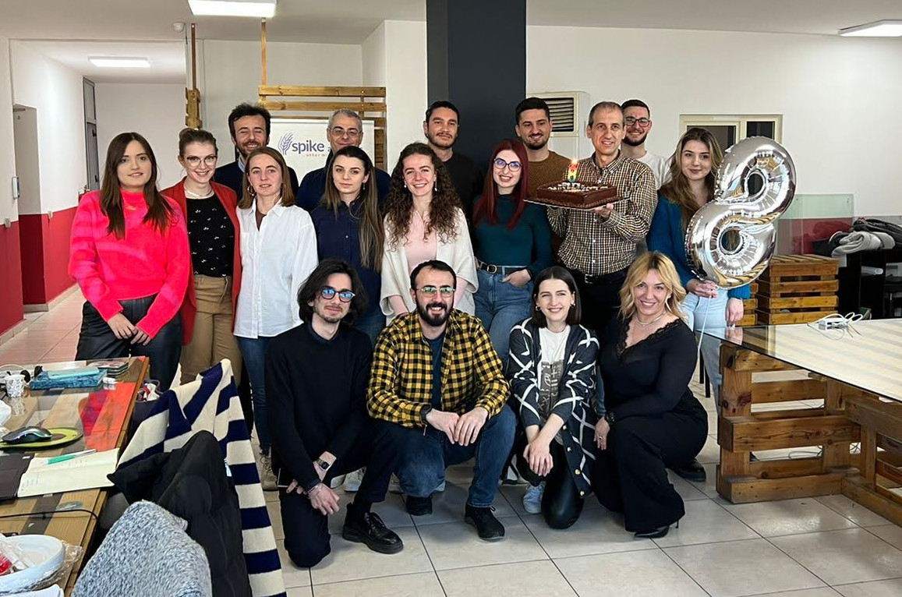

coreBOS is eight years old!

===

**Happy Birthday coreBOS!!**

Another year has flown by.

Eight years since we started this adventure. I was planning on centering this congratulation on the birthday of the software but, besides the fact that we already do that all year in this blog, I realized (as I sat having a tea in Tirana) that coreBOS isn't about a software, the software is just a common meeting place for an exceptional set of people from all over the world.

All of you, spread out in all continents, make coreBOS the awesome project it is. [It is all about the people.](https://youtu.be/12LnxlmofAU)

This year, I am lucky enough to spend this birthday with the incredible team in Tirana. Besides the amazing people they are, their knowledge of coreBOS doesn't cease to astonish me.

They, as all the rest of you that are part of the coreBOS, make it worth the effort.

As a birthday present we got [a new redesigned web site!!](https://corebos.com)

**coreBOS thanks you for permitting this dream to exist.**

 !!! **Happy Birthday from/to the whole coreBOS Team**
