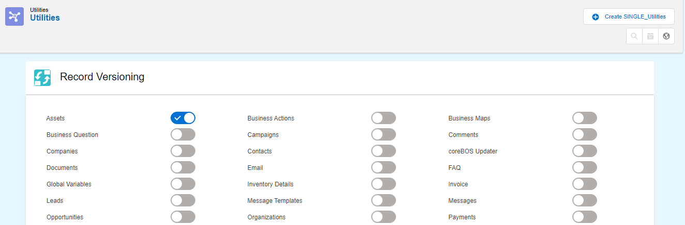

This month we have a great guest post from [Adisa Sinani](https://github.com/adisasinani) where she explains how the [Record Versioning](https://corebos.com/documentation/doku.php?id=en:adminmanual:recordversioning&noprocess=1) feature implemented by [Lorida Cito](https://github.com/loridacito) a few months ago, works. Enjoy!

===

When it comes to developing, **Version Control** is one of those things that you don’t need until you’re already regretting not having it. True, and one of the sad lessons ...

But besides developing there might be cases where you would want to track the history of the records in your coreBOS install.

[Record Versioning](http://corebos.com/documentation/doku.php?id=en:adminmanual:recordversioning&noprocess=1) does exactly what its name indicates: it creates different versions of the same record in the application permitting you to easily move from one to the other.

Under the hood, each version is a new record by itself but it is not shown as such. You can't see it in the ListView nor search for it, because of all the versions of a record, only the Active Version is shown as it will be explained below.

!!! Let’s start with the basics: How is Record Versioning activated?

To activate Record Versioning go to the **Utilities section** _(CRM URL/index.php?action=integration&module=Utilities)_, where you will find the Record Versioning configuration. There you can see a list of all the modules that you have installed in your coreBOS and you can activate the versioning for any module.

Let’s activate it for the Assets module.

Now that we have decided which module’s records we want to version, let’s proceed on using it.

Create a new record in your coreBOS install on the Assets module. As you already see, there are two main changes implemented:

- Firstly, on what version of the record are we now?
  Have a look at the two new fields added: **Version** and** Active Version**, telling us that by default we are on the first version of the record.

- Okay, but how can we create a new version?
  Here comes into play the second change: The Version Control block on your right. By just clicking on the **Create Version** button, a new version of this record will be created respecting all its relations.

You can move from one version to another by clicking the version you want and recovering it, or just double clicking on it.

By creating a new version for a record you are creating a space in the history of this record, whose changes don’t affect other versions, but can always be used as the starting point for another version.
You are the one that chooses the starting point, as you can create a new version starting from every previous version, and not just the first one.

!!! Do you want to make sure that only one record is created and not many?

Go to the ListView of the Assets. There is the same number of Assets listed. Go even further, sort them by their id. As you can see the record you were creating versions of is list only once, and the record displayed on the list is the active version of your choice.

Now you get the idea. It is that easy to create versions on coreBOS.

!!! Want to know more? Let’s get deeper on its functionality.

By default, when you create a new version you are also duplicating all its relations. In our case all the Documents and Support Tickets relating to Assets.

But, one may need only to duplicate Documents. Basically, is there a way to show coreBOS your customized needs. Of course there is!

That is all defined by the corebos Duplicate Relation map.

Proceeding with our expressed need above: Duplicate only Documents.

!!! Create a new Duplicate Records Mapping.

!! **Important:** Don’t forget the duplication business map should have the correct naming syntax: **{MODULE}\_DuplicateRelations**.

As coreBOS doesn’t stop getting richer and richer for this map you can use the [Generate Map functionality](https://www.youtube.com/watch?v=RFTBS9SbZHE&t=289s). On here you indicate only the modules you want to be duplicated: Documents in our case.

Go to Assets again. Choose the version you want as a starting point. As you will see the new version has only Documents related and not the Support Tickets. **Cool!**

!!! What else? Of course there is more...

As you know Assets are directly related to **Products**.

If you want to create a new product also when you create a new version you can do so.
In this way you have the exact product that was existing at the moment that you created that version. Just configure your Duplicate Relations Map and it will do all the work for you.

To remove the functionality just disable Record Versioning from the Utilities Panel. The version block will be removed from the module, while the fields won’t. That’s because after removing the functionality every version you had created will become a separate record. With these two fields you can still keep track of the versions you once tried to create.

Give it a try and let us know how it goes!

**Following the hard times of COVID-19, on behalf of all the coreBOS team, we want to wish you and all your loved ones safe passage through this difficult period.
Be strong as we get through this, together! **
