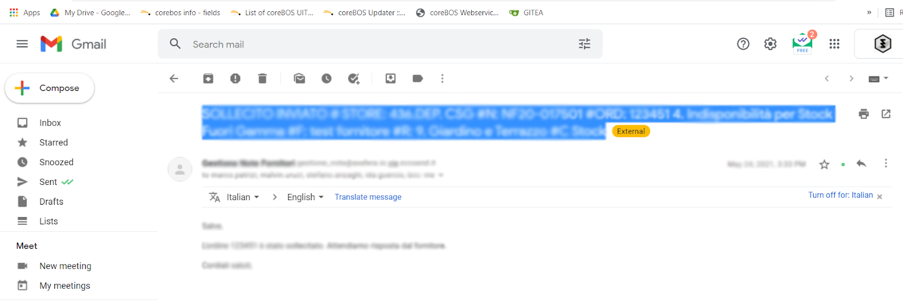
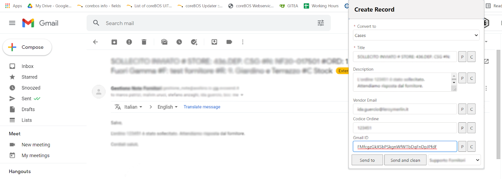

In this guest post from [Celeste Fejzo](https://www.linkedin.com/in/celeste-fejzo/) you will learn how to use 'Send to coreBOS' Chrome extension. This Chrome extension has been developed to facilitate the work of the support group in charge of receiving and responding to tickets created by the users. It provides semi-ready functionalities, like 'Copy', 'Paste' and 'Send to the CRM'.

===

## How to install the extension

1. Download link: [https://github.com/coreBOS/CreateRecordExtension](https://github.com/coreBOS/CreateRecordExtension)
2. Click on Code - Download Zip - and extract the file in your device
3. Go to Chrome and install the extension ( Extensions - Manage extensions - Load unpacked - Select the extracted folder of the zip file). After the extension has been installed, go to Extension options to configure the settings.

Add the data according to the following screenshot:

**Name** is the name of the CRM that will be used, **URL** is the address, **Secret & Key** are a set of characters generated for each coreBOS install.

**Modules** will include the names and field names of the modules where data entered in the CRM will be sent.

On the **Optional fields** section, the user will be able to include all the fields that will get information from the website.

Click *Save Settings* and you're ready to start using the extension.

When you haven't added any data to the extension yet, it will look like this:

In this extension, the user can copy the text only by highlighting the selected area that they want to copy. In the following screenshot, the email subject is selected and automatically copied.

When the user opens the extension, clicking on the **'P'** in the title input field will automatically paste the content highlighted.

## Adding Ticket Description

This is the same process as adding the ticket title. The user can highlight the subject of the email that they want to send to the CRM.

Then clicking on the P button, will paste the selected content.

## Adding Vendor Email

Vendor email goes in the Vendor email field. The highlighted text functionality doesn't apply to this field, so the user will have to copy the email manually.

Then place it in the extension's field.

## Adding Gmail ID

The Gmail ID is retrieved by copy functionality with the mouse or ctrl + c in the keyboard. Highlighting it with the mouse will not copy the content.

Then the user clicks on paste (mouse click or ctrl + p) in the Gmail ID field of the extension. The P button in this field is not functional.

## Sending the data to the CRM

Sending the data to the CRM is done in two ways: 'Send to' and 'Send and Clean' buttons. The difference is that while 'Send to' sends the information to the selected module of the CRM, it does not clear the content, so when you reload the tab the data still appears there.

While the 'Send and Clean' button sends the information to the CRM and clears the information entered earlier.

Sending the content of the extension will redirect the user to the CRM, in the selected module, where they can continue adding more information and save or cancel the record.

------------

Before closing the post I would like to [share a video presentation](https://youtu.be/QifyN1mq_Qs) I made of this extension when it was still in development, so you can get a little more knowledge. Thanks Celeste :-)

**Enjoy!**
