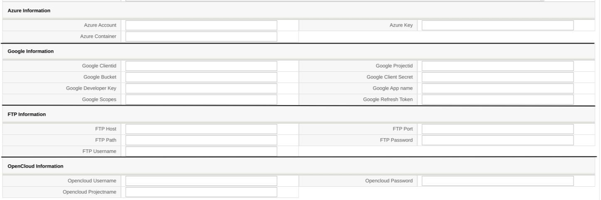
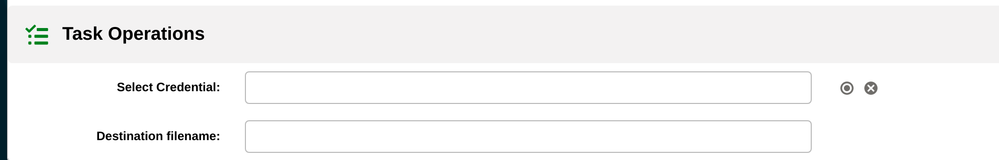

In the last blog post, [Generate Report Task](../generatereport) we learned how to configure your coreBOS to send any report/business question using e-mails. But there is a lot more that can be done.

Typically, the files you wish to share are much larger, and having them attached to a mail isn't the right thing to do.

This blog post covers how you can configure your coreBOS to transfer files to other platforms. Note, when I say file, that can be either a report or business question.

! Credentials Module

The work starts by configuring your destination platform using the Credentials(cbCredentials) module.

What is supported?

- FTP
- Google Cloud Storage
- Open Cloud
- Azure Blob Storage

After valorizing the field Adapter with the preferred Adapter, fill out only the fields of that configuration.
1 Credential record stands for 1 destination platform.

Please, reach out to our forum if you need help with the configurations of any of the adapters.

! Setup up your workflow

Following the previous blog post, your workflow setup should look something like this:

1. Execute Expression
2. Generate Report Task
3. Send Mail

We are going to replace Send Mail with the Send File task.

! Send File Task

The send file task follows the typical coreBOS layout workflow task.

- Select Credential: select the Credential record you have setup
- Destination filename: using coreBOS workflow language you can specify whatever name and extension you need, e.g. `concat('Report of date ',get_date('today'),'delivered.TXT')`

  

Hope this helped!

What comes next?? Till now, we learned how to generate and send files. The upcoming blog post will be about modifying the file itself, focusing on business questions!

Till the following blog post, make some superb memories, everyone :)

<a href='https://www.freepik.com/vectors/background'>Background vector created by rawpixel.com - www.freepik.com</a>
