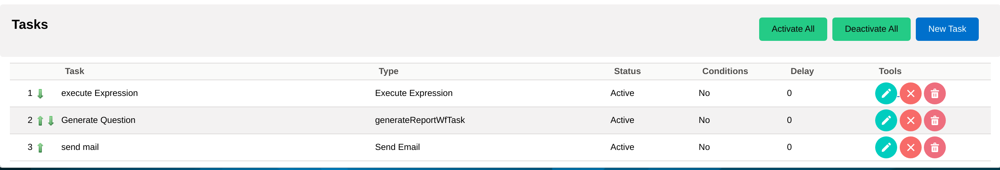
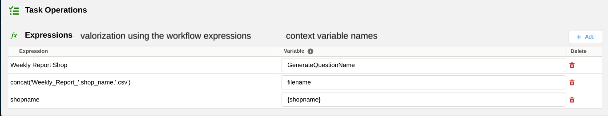

Hello there, we are meeting again :)

This blog post will talk about how we can send files with coreBOS using Business Questions.

===

We add support for Business Questions through the File type.
Let's get working on the use case analyzed [in the previous blog post](../generatereport) to understand how business questions ultimately facilitate work.

> > Let's say you have a set of 20 shops and got one report for each of them on coreBOS. You want to send weekly (any desired time-frequency) customized template mails to all 20 shops. Note that we have a module to save the shop records and correspondences (they aren't users).

!!! Create a business question that contains the following query:

```SQL
SELECT * FROM vtiger_project
INNER JOIN vtiger_crmentity ON vtiger_project.projectid = vtiger_crmentity.crmid
LEFT JOIN vtiger_cbshop ON vtiger_project.shop_related = vtiger_cbshop.cbshopid
WHERE vtiger_cbshop.shopname = '{shopname}'
AND deleted=0;
```

In the depicted query, we select all the records from the module Project(vtiger_project). Next, we need to group the information per shop, so we join the custom module Shops(vtiger_cbshop).
Notice that the `WHERE` condition isn't the standard SQL syntax.
`{shopname}` is a context variable in coreBOS.

!! What are context variables?

Context variables are the variables that can hold different values in different environments. In coreBOS, you can load results depending on the context set by the end-user.
In our use scenario, it isn't the end-user who will decide the value of the context but rather the workflow language. What do we mean by that?

Last time, using Reports, we created a scheduled workflow that looped through all the shop records and found the correspondent report. This implementation comes at the cost of creating as many reports as you have existing shops.

How about a way to dynamically decide the value of the shop we want to retrieve?

!!!! Let's jump to the workflows system



As you can see, the setup is exactly the same as the Reports one. The difference, besides the fact that you will choose a Business Question on the Generate Report Task, stands on the Execute Expression task:



- GenerateQuestionName: the name of the Business Question record we have implemented our query logic.
- filename: the name of the file that will be sent. Read more about this in the File Type Properties below.
- `{shopname}` we valorize here the context variable that we have on the business question. The scheduled workflow will loop on the first shop on the list of available shop records, valorize the context variable with that first shop's name, and send the value directly on the query. Isn't that powerful?!! We only need to create 1 BQ and play around with the conditions as needed using the workflow language!!

  !! What is there more to see?

The File type has an extended properties syntax that permits us to define the details of the generated CSV file. The complete properties object looks like this:

```JSON
{
"filename":"$variablename$", // special syntax $variablename$ which can be valorized using the workflow language to define the name of the file sent
"delimiter":";",             // single character to use as field separator. defaults to comma
"enclosure":"",              //single character to enclose strings that contain the delimiter
"postprocess": "deletedoublequotes", //removes the double quotes that enclose the strings
"format": [
"date":"Y-m-d",              // format to use for date fields
"float":{                    // format to use for decimal/currency fields
   "decimalseparator":"",
   "grouping":"",
   "numberdecimals":""
}
],
"columns":[                 // definition of the labels of the columns and the format of the field
{"label":"label1", "type":"string|date|integer|float|..."},
...
],
  "context_variables": {}
}
```

Note:

- if no formatting is given, then we will apply the current user's settings
- if no types are given in the columns, we will output the raw result as we do now

Learn more about how to build up powerful business questions [here](https://corebos.com/documentation/doku.php?id=en:adminmanual:businessquestions&noprocess=1).

Hope this helps :)

<span>Cover photo by <a href="https://unsplash.com/@xoforoct?utm_source=unsplash&amp;utm_medium=referral&amp;utm_content=creditCopyText">
EJ Strat</a> on <a href="https://unsplash.com/">Unsplash</a></span>
