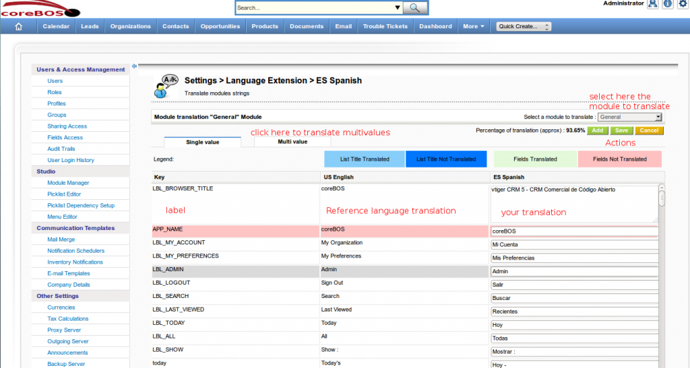

### Now we can translate labels from within the application!!

Thanks to the team at **OpenCubed** who have modified an abandoned project of many years ago, starting at **coreBOS 5.6**, we have the functionality to translate the labels from within the application.

This is specially important for **custom fields**, because we cannot use special characters, that are so important in many languages, neither in the labels or the picklist values.

 Due to that restriction we have to use plain text and then translate the values. Before having the incorporated translator functionality that translation had to be done directly editing the language files, now the admin user can easily do the change without needing access to the files which is **REALLY** important for hosted environments. 

To access the translator you must login as an admin user and go to the **Module Manager**. On the **Custom Modules** tab you will find the installed languages and next to each one the **hammer settings icon** which will take you to the translation screen.

You can get some [additional information on the wiki](http://corebos.org/documentation/doku.php?id=en:devel:translating&noprocess).

**
Happy Translating!!
**