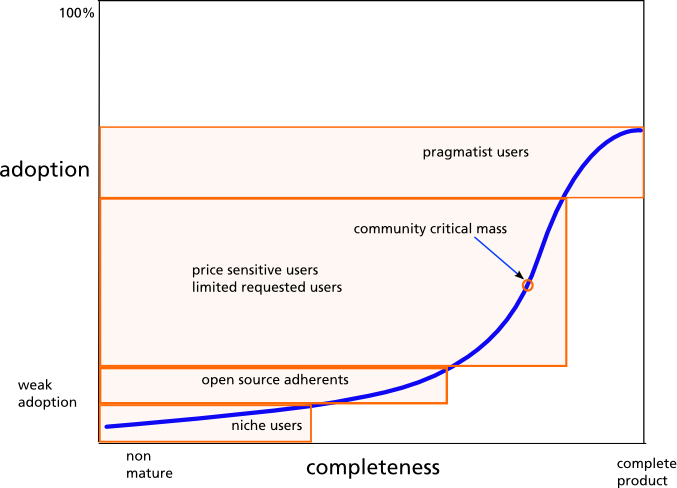

 ! This is a guest post by Andrea Alberici Evolutivo founder - coreBOS Evangelist

> "We are not making a real fork, we just have to stay to 5.4 because many people (clients) will never move to the new infrastructure"

Yes, i agreed when i read in between the lines in [coreBOS first "press-release"](../corebos-is-born)... also because we are serving many clients with DEEPLY customized vtigerCRM, and they are not willing to pay just to move to a new "nice" version (the crisis hit hard here in Italy).

In other words, that’s also what I understood the first time I read the announcement.

It is not a "_real_" fork... it is a soft fork in the logic of github in respect to vtigerCRM 5.4. **Yes, sure**. But there were also many open questions… particularly the possibility to start big projects and being "backed", so we flew to Valencia and enjoyed one day with Joe talking about this… At the end, I felt relieved, and it was much like a business deal: "**promise me that it will have a future and we will be supporting your idea**".

 So we started doing little things in the project, especially the first thing was bringing some "life savers" in our daily work: changing the labels using an extension ([you’ll see that we embedded a very old translation project into coreBOS](../translation-extension-for), and it is in production now)

But what i understood from the very first weeks playing with the project was that coreBOS … is a completely new beast. Especially on the delivery part. Github is a fantastic tool, to make easy adding new things and improving community interaction… but especially because it is something similar to continuous improvement and you can deliver it to your production installations, without the pain that we experienced every time we had to upgrade from one version to another.

When you think about new things that can help you in your daily routine (adding conditions, business rules: if it is like this, do that…), all of a sudden we have a new place to put them. And this is happening since last month... every time we need a new tool… we think how to embed it in **coreBOS**, knowing that it will be possible to do it.

Put it in another way, it’s all about open source as a tool: Open source is not a business model it is a distribution strategy that creates broad awareness, rapid adoption and enables a "**pull environment**".

That is what I realized that Joe is creating (probably, almost unconsciously) with coreBOS, so it’s just a matter of surviving a curve very flat in the beginning, regarding the **STAKEHOLDERS** behind an open source project. As soon as the user adoption and problem solved reaches a turning point… voilà… we will have the perfect software... ehhmm the perfect Community.

### NOW A REQUEST FOR EVERYBODY

I’m asking to think about this graphic which relates the user adoption and the completeness of the software itself in an open source community. WHERE do you think we are now? Are we niche users-developers? How far are we to arrive at a community critical mass? ... in reality the software is really complete… and growing... WHAT can we think (and do) to increase user adoption?

**
If we wait until we’re ready, we’ll be waiting for the rest of our lives
**
